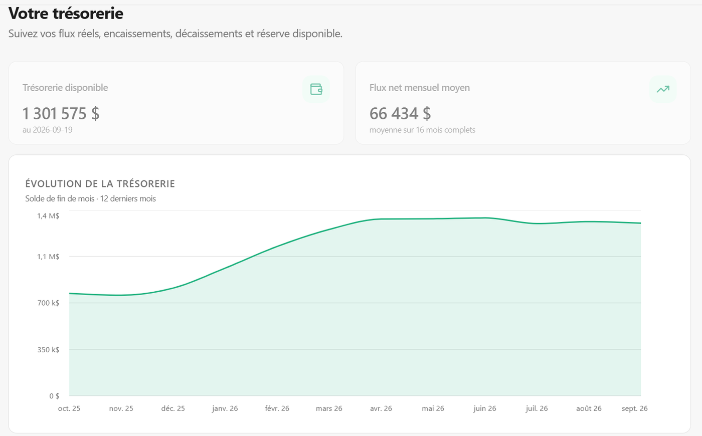

<div align="center">
  

  # Issa Ouedraogo
  ### Data Analyst · Business Intelligence · Analyse financière
  *Créateur de GESCOP (Application de pilotage financier pour PME)*

  **Donner du sens aux chiffres pour mieux décider au quotidien.**

  [](https://www.linkedin.com/in/issa-ouedraogo-34b146332/)
  [](https://github.com/Issa0900/Issa-Ouedraogo)
  [](https://gescop.ca)
  [](./portfolio_report.html)

  📧 **[issaouedraogo0900@gmail.com](mailto:issaouedraogo0900@gmail.com)** · 📍 **Québec**

</div>

---

> 🌐 **Site web du portfolio : [issa0900.github.io/Issa-Ouedraogo](https://issa0900.github.io/Issa-Ouedraogo/)**  
> 📖 **Dossier exécutif complet (24 pages web) : [Lire le rapport en ligne](./portfolio_report.html)**

---

## 👋 À propos : du terrain commercial au code

On me demande parfois comment un profil issu de la **gestion commerciale** en vient à construire une application SaaS complète.

La réponse tient en un constat de terrain : dans presque toutes les PME, les chiffres existent, mais ils sont éparpillés entre un logiciel de caisse, des relevés bancaires en PDF, des factures dans un classeur et des dépenses notées sur Excel. Le dirigeant passe ses fins de semaine à copier-coller des lignes et découvre sa marge nette avec plusieurs mois de retard.

Ce qui m'intéresse dans la donnée, ce n'est pas de créer des graphiques pour faire joli. C'est de répondre à des questions très concrètes :
* *Ce produit rapporte-t-il vraiment de l'argent après rabais et coûts directs ?*
* *À quel moment précis allons-nous faire face à une tension de trésorerie ?*
* *Où ouvrir notre prochain point de vente pour éviter la saturation concurrentielle ?*

Pour y répondre, j'associe la compréhension des affaires à la rigueur technique : **Python, SQL, Power BI, modélisation financière sous Excel**, et la conception de **GESCOP**.

---

## 🧭 Mon Parcours

```
GESTION ➔ FINANCE ➔ DATA ➔ BUSINESS INTELLIGENCE ➔ IA & AUTOMATISATION ➔ PRODUIT (GESCOP)
   │          │         │                │                      │                   │
   ▼          ▼         ▼                ▼                      ▼                   ▼
Réalité    Rentabilité  Nettoyage &     Tableaux de bord       Workflow encadré    Solution SaaS
PME & marges  BFR/DuPont  SQL/Python    Excel/Power BI        4 étapes (tests)    en production
```

### Chiffres Clés Vérifiables
| **7+** | **6** | **1** | **333** |
| :---: | :---: | :---: | :---: |
| **Projets Documentés**<br><sub>Code source & données ouverts</sub> | **Domaines Explorés**<br><sub>Finance, ventes, RH, stats...</sub> | **Application en Ligne**<br><sub>GESCOP (Base44/Deno)</sub> | **Tests Automatisés**<br><sub>Non-régression des calculs</sub> |

---

## 🧭 Projet Phare : GESCOP (Application SaaS)

> **Pourquoi j'ai décidé de construire cette application pour les PME.**

<div align="center">
  
</div>

J'ai créé **GESCOP** pour offrir aux dirigeants de PME la clarté financière qu'ils n'ont pas le temps de construire eux-mêmes :

* **La fin du casse-tête des fichiers :** L'utilisateur dépose ses fichiers hétérogènes (Excel, CSV, PDF). L'application reconnaît automatiquement les colonnes et signale les doublons sans jamais les supprimer en silence.
* **62 indicateurs vérifiables en 1 clic :** Suivi en temps réel de la trésorerie, du BFR, du runway cash, des marges par produit et de la rotation des stocks. Un clic sur n'importe quel chiffre permet d'inspecter la formule et les écritures sources.
* **Architecture moderne & pérenne :** React 18, Deno en TypeScript, PostgreSQL (38 tables relationnelles), Stripe pour les abonnements et **333 tests automatisés** pour garantir qu'aucun calcul ne dérive.
* 🔗 **Tester l'application en direct :** [gescop.ca](https://gescop.ca) · [Voir le dossier technique →](./gescop/)

---

## 📊 Six Projets, Six Vrais Problèmes d'Entreprise

Chaque dossier ci-dessous est un cas d'étude complet avec son code, ses données et la démarche : **Question initiale ➔ Données ➔ Ce que montre l'analyse ➔ Décision concrète**.

| Projet | La Question du Gestionnaire | Données & Contexte | Outils Clés | Ce que l'on Retient |
|---|---|---|---|---|
| 💼 **[Finance de Démarrage](./analyse-financiere-demarrage/)** | *« Pourquoi une entreprise avec 4,9 M$ de ventes prévues peut-elle faire faillite au 3e mois ? »* | **4,90 M$** CA projeté · 29 feuilles | Excel Avancé · Python · DuPont · Acomba | Creux de trésorerie de 103 k$ au T1 lié aux stocks : marge de sécurité de 150 k$ indispensable. |
| 📊 **[Dashboard Ventes Superstore](./dashboard-ventes-performance/)** | *« Notre chiffre d'affaires augmente, mais où passe notre bénéfice ? »* | **9 988 commandes** auditées | Excel Avancé · TCD dynamiques · Python | Pertes de 21 k$ sur Tables et Bookcases causées par des rabais > 20 %. Plafonnement à 15 %. |
| 📈 **[Analyse des Performances RH](./analyse-performances-rh/)** | *« Est-ce qu'augmenter les salaires suffit à motiver et retenir une équipe ? »* | **311 collaborateurs** · HRDataset | Python (Pandas, Matplotlib) · 1,5×IQR | Corrélation salaire/performance quasi-nulle (r=0,13). En revanche, les retards (r=-0,73) alertent sur le désengagement. |
| 🔬 **[Statistiques Inférentielles](./analyse-statistique-inferentielle/)** | *« Comment être certain que nos résultats ne sont pas un simple coup de chance ? »* | **2 705 observations** (3 jeux) | Python · Scipy · Statsmodels | 36 contrôles statistiques recalculés sous Python sans aucun écart avec le classeur d'origine. |
| 🗺️ **[Géomarketing Québec](./geomarketing-quebec/)** | *« Où ouvrir notre prochain point de vente pour maximiser nos chances de succès ? »* | **257 755 entreprises** (Source ISQ) | Python · SQL · Données publiques ISQ | Montréal est saturé de concurrents ; les couronnes périphériques (Laval, Montérégie) offrent un bien meilleur ratio. |
| 🤖 **[IA & Automatisation Analytique](./integration-ia/)** | *« Comment profiter de la rapidité de l'IA sans risquer d'introduire des erreurs ? »* | Pratique continue en production | Claude Code · Tests unitaires · Git | Protocole strict en 4 temps (cadrage, génération, audit, intégration). Calculs 100 % déterministes. |

---

## 🛠️ Ce que je sais faire au quotidien

```
┌──────────────────────────────────────┐   ┌──────────────────────────────────────┐
│               ANALYSER               │   │               MODÉLISER              │
├──────────────────────────────────────┤   ├──────────────────────────────────────┤
│ • Explorer et nettoyer des données   │   │ • Marges réelles par produit         │
│ • Python 3 (Pandas, NumPy, Scipy)    │   │ • Trésorerie prévisionnelle à 3 mois │
│ • SQL (requêtes, jointures, filtres) │   │ • Besoin en fonds de roulement (BFR) │
│ • Détection des valeurs aberrantes   │   │ • Seuil de rentabilité & ratios      │
└──────────────────────────────────────┘   └──────────────────────────────────────┘
┌──────────────────────────────────────┐   ┌──────────────────────────────────────┐
│              VISUALISER              │   │              AUTOMATISER             │
├──────────────────────────────────────┤   ├──────────────────────────────────────┤
│ • Tableaux de bord Power BI (DAX)    │   │ • Scripts Python d'automatisation    │
│ • Excel Avancé (TCD, SOMME.SI.ENS)   │   │ • Élimination des copier-coller      │
│ • Graphiques sobres et lisibles      │   │ • Intégration encadrée de l'IA       │
│ • Storytelling de données orienté DA │   │ • Web Scraping de données ouvertes   │
└──────────────────────────────────────┘   └──────────────────────────────────────┘
```

---

## 🛡️ Rien n'est inventé, tout est vérifiable

| Compétence Clé | Projet Associé | Données Sources | Livrable Vérifiable | Statut de Traçabilité |
|---|---|---|---|---|
| **Finance d'Entreprise** | Analyse Financière Démarrage | Acomba / Modèle | Classeur 29 feuilles | ✅ Cascade & DuPont réconciliés |
| **Business Intelligence** | Dashboard Ventes Superstore | 9 988 commandes | Cockpit Excel dynamique | ✅ Formules SOMME.SI.ENS & filtres |
| **Statistiques & Outliers** | Analyse des Performances RH | HRDataset (311 profils) | Jupyter Notebook | ✅ Règle 1,5×IQR documentée |
| **Inférence Statistique** | Statistiques Inférentielles | 3 jeux (2 705 obs) | Script Python Scipy | ✅ 36 contrôles sans divergence |
| **Analyse Territoriale** | Géomarketing Québec | 257 755 étab. (ISQ) | Palmarès 17 régions | ✅ Source publique ISQ documentée |
| **IA Appliquée** | Workflow IA & Automatisation | Données réelles | Commits & architecture | ✅ Revue humaine systématique |
| **Conception Produit** | GESCOP SaaS | Multi-formats PME | Web App en ligne | ✅ 333 tests automatisés réussis |

---

## 📬 Échangeons ensemble

Disponible pour discuter de vos besoins d'analyse, d'optimisation de vos rapports ou pour vous faire une démonstration de GESCOP :

- 📧 **Courriel :** [issaouedraogo0900@gmail.com](mailto:issaouedraogo0900@gmail.com)
- 💼 **LinkedIn :** [linkedin.com/in/issa-ouedraogo-34b146332/](https://www.linkedin.com/in/issa-ouedraogo-34b146332/)
- 🐙 **GitHub :** [github.com/Issa0900](https://github.com/Issa0900)
- 🧭 **GESCOP Live :** [gescop.ca](https://gescop.ca)

*Québec · 2026*
