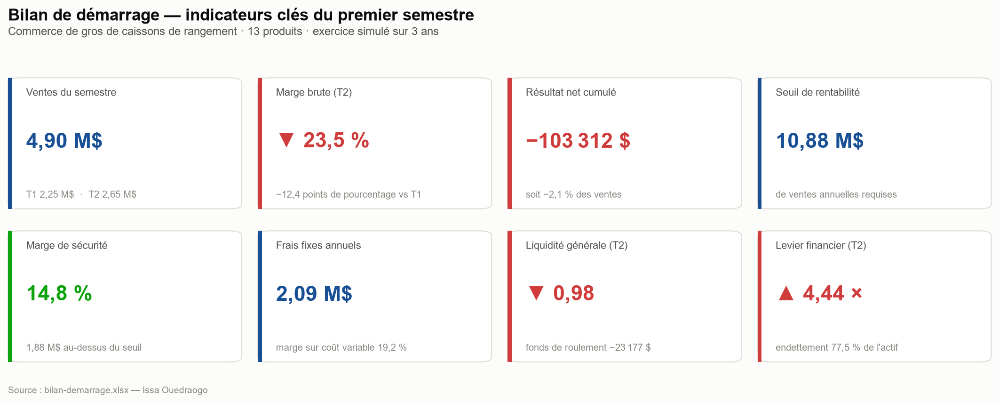
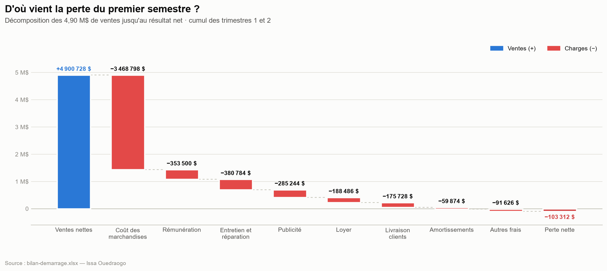
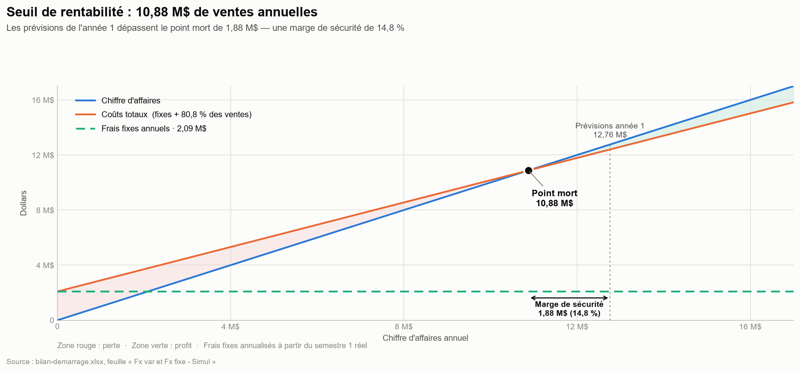
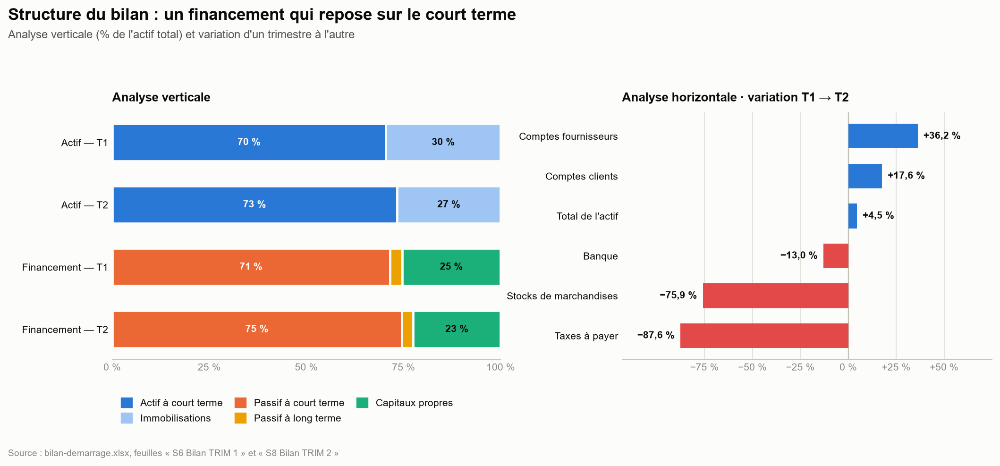
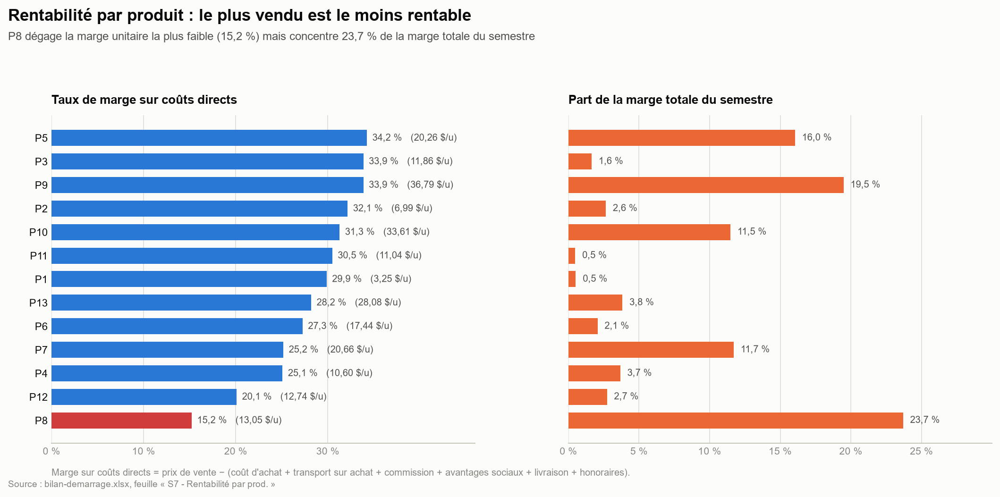
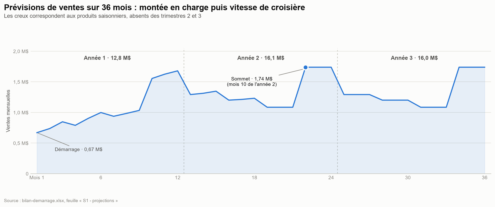

# 💼 Bilan de démarrage & analyse financière d'une entreprise commerciale


Modélisation financière complète du démarrage d'une entreprise de distribution (13 produits) : du dimensionnement des ressources et du montage financier jusqu'aux états financiers de deux trimestres d'exploitation, avec analyse par ratios, seuil de rentabilité et rentabilité par produit.

> 📁 Fichier livrable : [`bilan-demarrage.xlsx`](./bilan-demarrage.xlsx) — 29 feuilles de travail
> · 👁️ [**Ouvrir en ligne (Office Viewer)**](https://view.officeapps.live.com/op/view.aspx?src=https%3A%2F%2Fraw.githubusercontent.com%2FIssa0900%2FIssa-Ouedraogo%2Fmain%2Fanalyse-financiere-demarrage%2Fbilan-demarrage.xlsx)
> · ⬇️ [Télécharger](https://github.com/Issa0900/Issa-Ouedraogo/raw/main/analyse-financiere-demarrage/bilan-demarrage.xlsx)
>
> ℹ️ GitHub ne prévisualise pas les classeurs Excel de cette taille (29 feuilles, formules nombreuses, tableaux d'amortissement). Utilise le lien **« Ouvrir en ligne »** pour le consulter dans le navigateur, ou télécharge-le. Les visuels ci-dessous sont générés par script à partir des vraies données du classeur.



---

## 🧩 Contexte métier

Une entreprise se lance dans la distribution de **13 produits de rangement** (caissons vendus par lots, tarifés au mètre cube). Avant d'ouvrir, il faut répondre à des questions qui engagent plusieurs millions de dollars :

- Combien d'espace, d'employés, de caisses et d'équipement faut-il réellement ?
- Vaut-il mieux **acheter ou louer** le bâtiment ?
- Quel **transporteur** choisir pour la commande d'ouverture ?
- Comment **financer** le démarrage, et l'entreprise tient-elle debout une fois lancée ?

Le projet répond à ces questions par la modélisation, puis **simule deux trimestres d'exploitation réels** (saisie des transactions en comptabilité Acomba, production des états financiers) pour confronter le plan à la réalité.

## 🎯 Objectif du projet

Construire un modèle financier de démarrage complet et vérifiable, puis en tirer un **diagnostic chiffré** : l'entreprise est-elle viable, où se perd la marge, et quels leviers actionner en priorité.

## 🗂️ Données et périmètre

| | |
|---|---|
| **Nature** | Modélisation financière intégrale, construite à partir d'un énoncé d'entreprise (prix, coûts, capacités, contraintes de financement) |
| **Volume** | 29 feuilles de travail, ~1 Mo |
| **Produits** | 13 références, dimensions en m³, coûts et prix unitaires, tailles de lot, demandes min./max. |
| **Horizon** | Prévisions de ventes mensuelles sur **36 mois** + 2 trimestres d'exploitation simulée |
| **Comptabilité** | Écritures complètes (ventes, achats, salaires, amortissements, TPS/TVQ, emprunts) saisies dans **Acomba** |

**Contrôle qualité des données.** Le classeur conserve quelques cellules en erreur (`#VALUE!`, `#NUM!`) dans des **zones de scénario non utilisées** — par exemple le tableau d'amortissement d'un quatrième emprunt dont le montant est à 0, ce qui rend le calcul de versement indéfini. Le script d'extraction les exclut explicitement plutôt que de les convertir silencieusement en zéro.

## 🛠️ Compétences démontrées

**Analyse financière**
- États des résultats et bilans, **analyse verticale** (% de l'actif / des ventes) et **analyse horizontale** (variation d'un trimestre à l'autre)
- Ratios de liquidité, d'endettement, de rotation de l'actif et de levier financier
- **Décomposition DuPont** du rendement des capitaux propres (marge × rotation × levier)
- **Seuil de rentabilité** par la méthode des frais variables / frais fixes, marge sur coût variable, marge de sécurité, simulation multi-scénarios et répartition du point mort par produit
- **Rentabilité par produit** sur la base des coûts directs (achat, transport, commission, avantages sociaux, livraison, honoraires)

**Gestion et coût de revient**
- Dimensionnement des ressources à partir du volume de marchandises : bâtiment, caisses, employés, équipement de manutention
- Arbitrage **achat vs location** du bâtiment ; comparaison de transporteurs **FTL vs LTL**
- Tableaux d'amortissement d'emprunts, calcul des salaires, retenues à la source et avantages sociaux
- Écritures comptables et gestion des taxes **TPS/TVQ**

**Analyse de données**
- **Python (`openpyxl`, `pandas`)** : extraction automatisée des 29 feuilles vers des CSV propres, avec **recalcul indépendant** de tous les ratios et contrôles croisés automatiques
- **Python (`matplotlib`)** : génération des six visuels d'analyse, reproductibles par script

## 📁 Contenu du dépôt

```
analyse-financiere-demarrage/
├── bilan-demarrage.xlsx        # le classeur complet (29 feuilles)
├── scripts/
│   ├── extraction_kpi.py       # xlsx  -> CSV, avec recalculs et contrôles
│   └── graphiques.py           # CSV   -> les 6 figures
├── data/                       # sorties CSV (états, ratios, seuil, produits...)
└── assets/                     # les 6 figures d'analyse
```

### Structure du classeur

| Bloc | Feuilles | Contenu |
|---|---|---|
| Données & prévisions | `Données`, `S1 - projections` | 13 produits, prévisions de ventes mensuelles sur 3 ans avec saisonnalité |
| Démarrage | `S2 - Inventaire départ`, `S3 - IMMO`, `S4 - Montage financier` | Commande d'ouverture, choix du transporteur, dimensionnement, bilan d'ouverture |
| Outils d'exploitation | `S5 - Outil Ventes`, `S5 - Outil Charges`, `S5 - Emprunt`, `S5 - salaire` | Ventes réelles, calcul détaillé de chaque charge, amortissement des emprunts, paie |
| Comptabilité | `S5 / S8 - Transactions Acomba` | Écritures des deux trimestres, TPS/TVQ |
| États financiers | `S6 États des résultats TRIM 1 / 2`, `S6 Bilan TRIM 1`, `S8 Bilan TRIM2` | États comparatifs avec analyses verticale et horizontale |
| Analyses | `S7 - Rentabilité par prod.`, `Fx var et Fx fixe - Simul` | Marge par produit, seuil de rentabilité, scénarios |

---

## 💡 Diagnostic et insights

### 1. La perte se résorbe, mais la marge brute décroche



Sur le semestre, **4,90 M$ de ventes** produisent une **perte nette de 103 312 $** (−2,1 % des ventes). La perte se réduit fortement d'un trimestre à l'autre : **−69 656 $ (−3,09 %) au T1** puis **−33 656 $ (−1,27 %) au T2**.

Mais la **marge brute chute de 35,9 % à 23,5 %**, soit 12,4 points. La cause principale est identifiable : les **frais de transport sur achats de 251 070 $** apparaissent au T2 et pèsent à eux seuls **9,5 % des ventes du trimestre**. C'est le premier levier à travailler — soit en renégociant le transport, soit en commandant en volumes qui remplissent les camions.

### 2. Hors campagne de lancement, le T1 était rentable

La publicité passe de **276 244 $ au T1** à **9 000 $ au T2** : le T1 porte une campagne de lancement non récurrente de **267 244 $**. Retirée du calcul, le premier trimestre affiche un **bénéfice d'environ 198 000 $**. La perte du démarrage est donc largement un **investissement de lancement**, pas un déficit d'exploitation structurel.

### 3. Le seuil de rentabilité est atteignable — mais la marge sur coût variable est mince



Avec **19,2 % de marge sur coût variable** et **2,09 M$ de frais fixes annuels**, le point mort s'établit à **10,88 M$ de ventes annuelles**. Les prévisions de l'année 1 (12,76 M$) le dépassent de **1,88 M$**, soit une **marge de sécurité de 14,8 %**.

Deux nuances importantes :
- Une marge sur coût variable de 19,2 % signifie qu'il faut **5,21 $ de ventes pour couvrir 1 $ de frais fixes**. Toute dérive des frais fixes se paie très cher en chiffre d'affaires.
- Les frais fixes annuels sont obtenus en **doublant** ceux du semestre 1 — ce qui reconduit une deuxième fois la campagne de lancement. En retirant cette dépense unique, les frais fixes en régime de croisière tombent à **1,55 M$** et le seuil à **8,09 M$**. *(Calcul de sensibilité effectué dans `extraction_kpi.py`, hors classeur.)*

### 4. Le vrai risque est la liquidité, pas la rentabilité



- Le **ratio de liquidité générale reste sous 1** aux deux trimestres (0,99 puis 0,98) : le **fonds de roulement est négatif**, à −18 271 $ puis −23 177 $.
- Les **comptes fournisseurs bondissent de +36,2 %** pendant que la **banque recule de 13,0 %** : la croissance est financée par les fournisseurs.
- Le **levier financier passe de 3,94 à 4,44** et l'endettement de 74,6 % à 77,5 % de l'actif.

L'entreprise devient donc *moins déficitaire* mais *plus fragile*. Priorité opérationnelle : accélérer l'encaissement des comptes clients (1,07 M$ au T2, +17,6 %) plutôt que d'allonger encore le crédit fournisseur.

### 5. Le produit le plus vendu est le moins rentable



**P8 concentre 23,7 % de la marge totale** du semestre tout en affichant **le plus faible taux de marge (15,2 %)**. Son volume de 1,80 m³ par unité — le plus élevé de la gamme — lui coûte **6,60 $ de transport à l'achat et 5,40 $ de livraison par unité**, contre 0 $ de livraison pour la plupart des autres produits.

À l'inverse, **P9 combine le meilleur profil** : 33,9 % de taux de marge et 19,5 % de la marge totale, pour un volume de seulement 0,56 m³. **P5** (34,2 %, 16,0 % de la marge) est le second à pousser.

> **Recommandation** : réorienter l'effort commercial vers P9, P5 et P10, et revoir soit le prix soit la logistique de P8 — le seul produit dont la rentabilité dépend entièrement du volume écoulé.

### 6. Les décisions de démarrage ont bien été arbitrées



- **Location plutôt qu'achat du bâtiment** : l'option achat portait l'actif à 3,66 M$ contre 2,27 M$ en location, avec un **trou de financement de 1,48 M$** impossible à combler avec les sources disponibles. L'arbitrage était contraint, et il est documenté.
- **Transporteur** : le LTL (Desgagné, 27 959 $) l'emporte sur le FTL (30 250 $) pour la commande d'ouverture, soit **2 291 $ économisés (−7,6 %)**.
- **Saisonnalité** : trois produits ne se vendent qu'aux trimestres 1 et 4, trois autres qu'aux trimestres 2 et 4. Les creux visibles aux mois 4 à 9 en découlent directement — ils sont voulus, pas subis.

---

## 🚀 Reproduire l'analyse

Les figures et les CSV ne sont pas des captures : ils se régénèrent depuis le classeur.

```bash
pip install openpyxl pandas matplotlib
```

```bash
python scripts/extraction_kpi.py && python scripts/graphiques.py
```

Le premier script affiche ses **contrôles croisés** au fur et à mesure — écart entre le cumul et la somme des trimestres, équilibre `Actif = Passif + Capitaux`, seuil recalculé vs seuil du classeur, somme des ventes mensuelles vs totaux annuels. Tous doivent ressortir à 0.

## 🧠 Choix méthodologiques

**Recalculer plutôt que recopier.** Le classeur contient déjà ses cellules de ratios. Le script ne les lit pas : il extrait les **postes bruts** et recalcule marges, liquidité, rotation, levier et seuil de rentabilité de façon indépendante, puis compare. C'est ce qui permet d'affirmer que les chiffres cités ici sont justes plutôt que simplement recopiés.

**Ne jamais convertir une erreur en zéro.** Les cellules `#VALUE!` / `#NUM!` des zones de scénario inutilisées sont filtrées explicitement (`ERREURS_EXCEL`). Une erreur transformée en `0` fausserait silencieusement une somme.

**Séparer l'extraction de la visualisation.** `extraction_kpi.py` produit des CSV ; `graphiques.py` ne lit que ces CSV. Les données intermédiaires sont donc inspectables, et un changement de graphique ne nécessite pas de rouvrir le classeur.

**Lisibilité des visuels.** Palette validée pour les principales formes de daltonisme (écart CVD ΔE ≥ 8 sur les paires adjacentes), avec étiquettes directes sur chaque série — la couleur n'est jamais le seul porteur d'information.

## ⚠️ Limites

- Les chiffres proviennent d'un **exercice de modélisation** fondé sur un énoncé d'entreprise : ce sont des données de simulation, pas les résultats d'une entreprise réelle.
- L'horizon d'exploitation observé est de **deux trimestres**. Les ratios de rotation et le seuil annualisé reposent donc sur une extrapolation, dont l'effet est quantifié au point 3 ci-dessus.
- Le seuil de rentabilité suppose la structure de coûts et le mix produits du semestre 1 constants.

## 📬 Contact

Réalisé par **Issa Ouedraogo**, [issaouedraogo0900@gmail.com](mailto:issaouedraogo0900@gmail.com)

[← Retour au portfolio](../)
