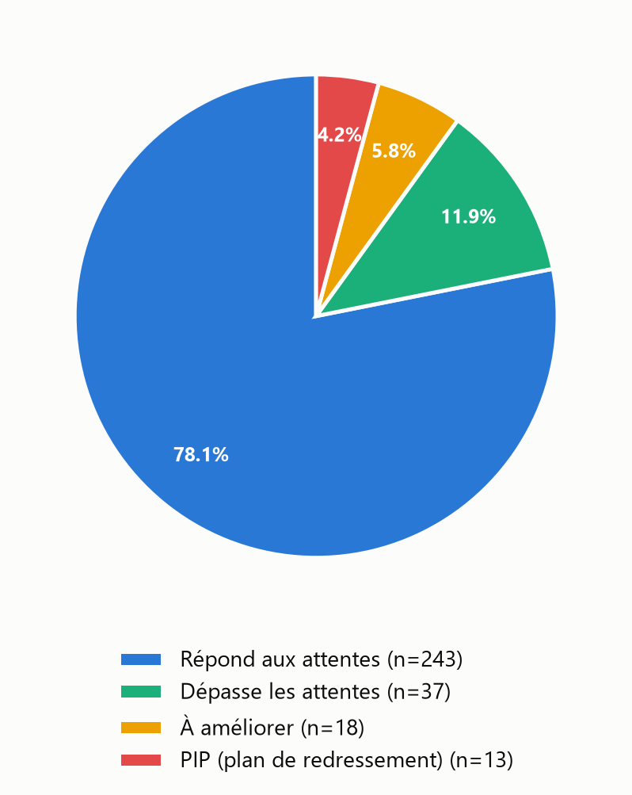
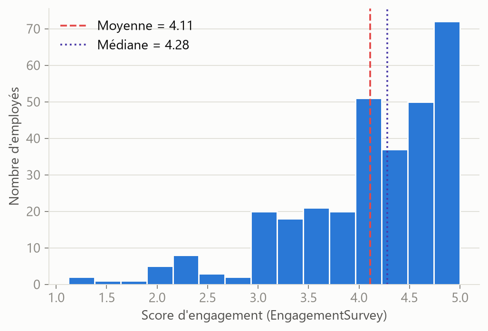
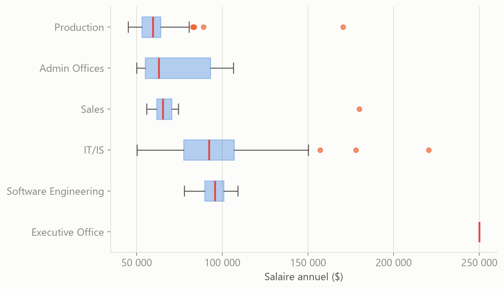
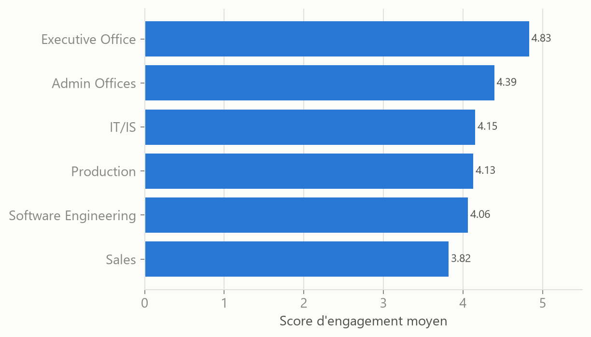
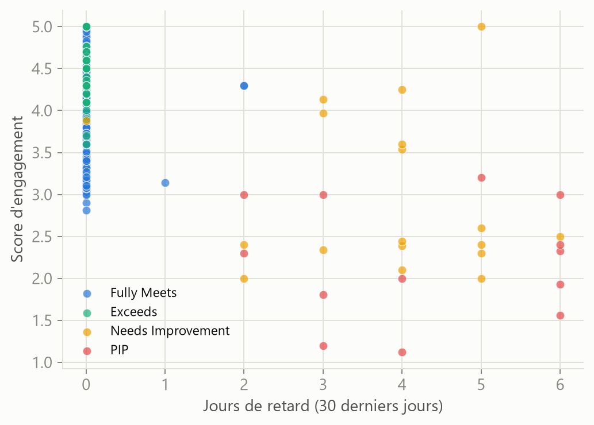

# 📈 Analyse des performances RH — Statistiques descriptives & détection d'outliers


Analyse statistique de la performance de 311 employés pour identifier les vrais leviers d'amélioration (au-delà de la rémunération) et les profils à risque de désengagement ou de départ.

> 📁 Script : [`analyse_performance.py`](./analyse_performance.py) · 📊 Graphiques : [`generer_graphiques.py`](./generer_graphiques.py) · 🗂️ Données : [`data/HRDataset_v14.csv`](./data/HRDataset_v14.csv)



---

## 🧩 Contexte métier

Une entreprise veut comprendre la répartition de la performance de ses employés, identifier les écarts et détecter les cas atypiques (outliers), pour orienter ses actions RH plutôt que de piloter à l'instinct.

## 🎯 Objectif du projet

Étudier les distributions des scores de performance, de l'engagement et des heures travaillées, détecter les valeurs aberrantes avec la règle du 1,5 × IQR, et en tirer des recommandations concrètes.

## 🗂️ Données

| | |
|---|---|
| **Source** | HRDataset_v14 — jeu de données RH de référence pour l'exercice académique |
| **Volume** | 311 employés, 36 variables (actifs et sortis) |
| **Répartition** | 207 employés actifs, 104 sortis |
| **Variables clés** | Salaire, score de performance, engagement, satisfaction, absences, retards, projets spéciaux, département |

**Nettoyage effectué** :
- Correction de l'encodage (BOM UTF-8 sur l'en-tête)
- Suppression des espaces de fin sur `Department` et `ManagerName` (ex. `"Production       "` → `"Production"`), sans quoi les regroupements par département étaient faussés

## 🛠️ Compétences techniques démontrées

- **Statistiques descriptives** (`pandas`) : moyenne, médiane, mode, écart-type, variance, quartiles, asymétrie
- **Détection d'outliers** avec la règle des **1,5 × IQR**, appliquée et interprétée sur 5 variables
- **Visualisation** (`matplotlib`) : histogramme, boxplots, pie chart, diagramme en barres, nuage de points
- **Analyse de corrélation** pour hiérarchiser les facteurs réellement liés à la performance
- **Esprit critique statistique** : identifier quand une règle automatique (IQR) produit un artefact plutôt qu'une vraie anomalie, et l'expliquer plutôt que la prendre au pied de la lettre

## 📁 Structure du projet

| Fichier | Contenu |
|---|---|
| `data/HRDataset_v14.csv` | Données sources |
| `analyse_performance.py` | Statistiques descriptives, détection d'outliers (1,5×IQR), corrélations, croisements |
| `generer_graphiques.py` | Génère les 6 visualisations dans `assets/` |
| `assets/` | Graphiques exportés (PNG) |

## 💡 Insights clés

- **78,1 % des employés « répondent aux attentes »**, 11,9 % les dépassent ; **10 %** (31 employés) sont « à améliorer » ou en plan de redressement (PIP) — c'est ce groupe qui doit concentrer l'attention RH.
- **Le salaire n'explique presque pas la performance** (corrélation r = 0,13). Ce qui la prédit vraiment : la **ponctualité** (r = -0,73) et l'**engagement** (r = +0,54). Payer plus ne suffit pas à faire performer davantage dans cet échantillon.
- **29 employés (9,3 %)** ont un salaire statistiquement atypique (> 96 838 $), presque tous des postes de direction ou de gestion IT — cohérent avec la hiérarchie. Un cas détonne : un gestionnaire IT à 157 000 $ avec une performance « Needs Improvement », un écart rémunération/performance à documenter.
- **9 employés ont un engagement anormalement bas** (< 2,17/5) : un signal de désengagement à traiter nommément avant qu'il ne se traduise en sous-performance ou en départ.
- **Contre-intuitif sur le turnover** : ce ne sont pas les employés en PIP qui partent le plus (38,5 %), mais ceux classés « à améliorer » (55,6 %) — probablement des départs volontaires anticipés, avant toute mesure formelle.
- **Limite méthodologique documentée** : pour les variables concentrées à zéro (retards, projets spéciaux), Q1 = Q3 = 0, donc l'IQR = 0 et *toute* valeur non nulle est mathématiquement « outlier ». Ce n'est pas une anomalie individuelle mais un artefact statistique propre aux distributions zero-inflated — la lecture a été ajustée en conséquence plutôt que citée telle quelle.

## 📊 Visualisations

| | |
|---|---|
|  |  |
|  |  |

## 🚀 Comment reproduire l'analyse

```bash
pip install pandas numpy matplotlib
python analyse_performance.py      # statistiques descriptives, outliers, corrélations (console)
python generer_graphiques.py       # régénère les graphiques dans assets/
```

## 🧠 Choix méthodologique : la règle IQR n'est pas neutre

La règle des 1,5 × IQR est standard, mais elle suppose implicitement une distribution avec un minimum de variance dans les quartiles centraux. Sur une variable où plus de 75 % des valeurs sont à zéro (ex. retards, projets spéciaux), l'IQR s'effondre à 0 et la règle étiquette *toute* valeur positive comme aberrante — 22,5 % des employés se retrouvent ainsi « outliers » sur les projets spéciaux, ce qui reflète en réalité la nature du poste (Production vs bureau), pas une anomalie. Appliquer une règle statistique sans vérifier ses hypothèses de forme aurait produit une conclusion trompeuse dans le rapport final.

## 📬 Contact

Réalisé par **Issa Ouedraogo** — [issaouedraogo0900@gmail.com](mailto:issaouedraogo0900@gmail.com)

[← Retour au portfolio](../)
