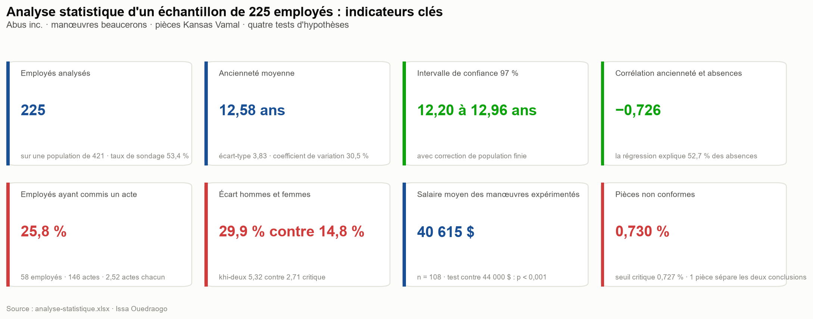
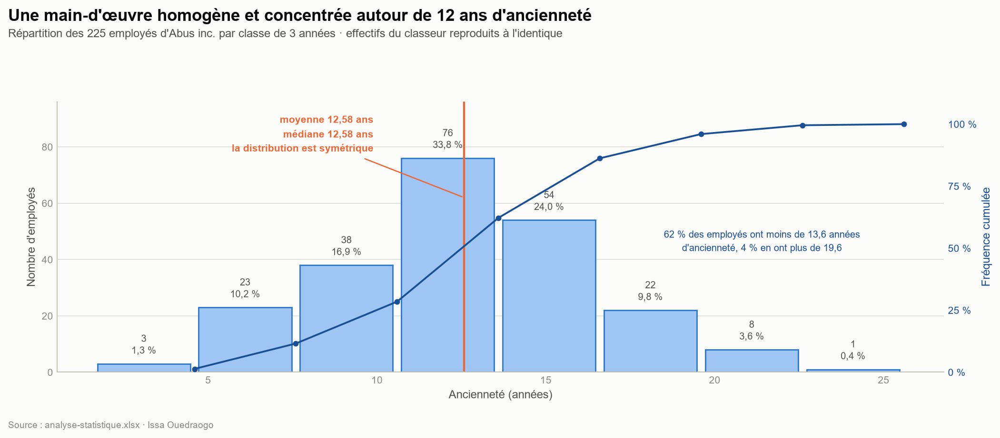
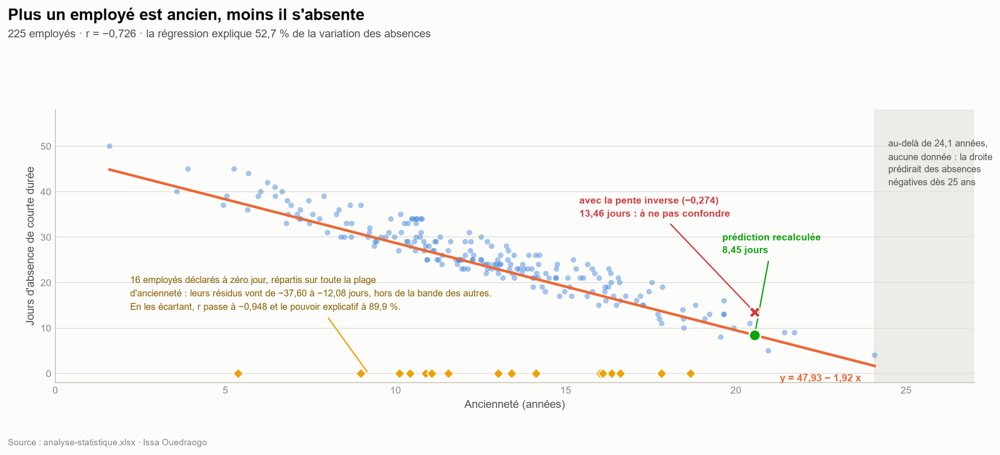
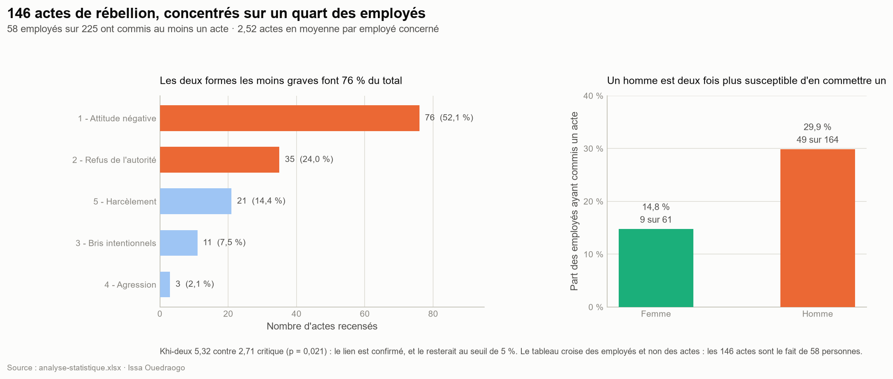
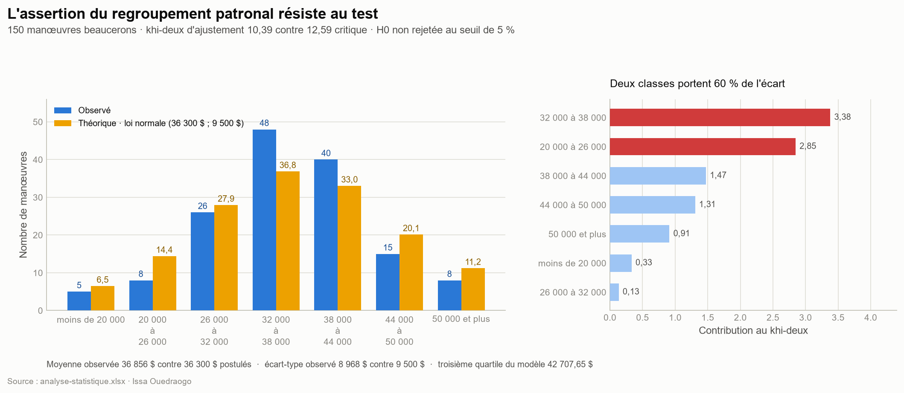
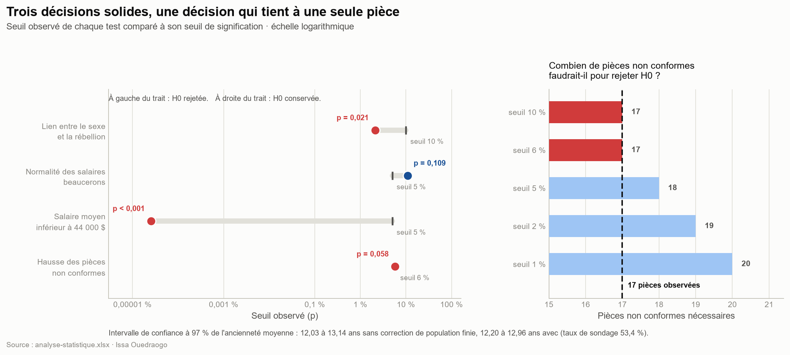

# 📊 Analyse statistique et tests d'hypothèses sur trois échantillons


Analyse complète de trois échantillons : 225 employés d'une entreprise, 150 manœuvres d'une région et 2 330 pièces livrées par un fournisseur. Distribution et mesures de tendance centrale, corrélation et régression, intervalle de confiance, puis quatre tests d'hypothèses (khi-deux d'indépendance, khi-deux d'ajustement, test sur une moyenne, test sur une proportion).

Chaque résultat est doublé d'un **recalcul indépendant en Python**, qui repart des données brutes et refait les mesures, les intervalles et les tests avec ses propres lois de probabilité. Le classeur passe les **36 contrôles croisés sans un seul écart**.

> 📁 Fichier livrable : [`analyse-statistique.xlsx`](./analyse-statistique.xlsx), 11 feuilles de travail
> · 👁️ [**Ouvrir en ligne (Office Viewer)**](https://view.officeapps.live.com/op/view.aspx?src=https%3A%2F%2Fraw.githubusercontent.com%2FIssa0900%2FIssa-Ouedraogo%2Fmain%2Fanalyse-statistique-inferentielle%2Fanalyse-statistique.xlsx)
> · ⬇️ [Télécharger](https://github.com/Issa0900/Issa-Ouedraogo/raw/main/analyse-statistique-inferentielle/analyse-statistique.xlsx)
>
> ℹ️ Les visuels ci-dessous sont générés par script à partir des données brutes du classeur, pas capturés à l'écran.



---

## 🧩 Contexte

Trois questions posées à partir de trois échantillons distincts :

- **Abus inc.** vit une vague d'actes de rébellion et un absentéisme élevé. Sur 421 employés, 225 ont été échantillonnés. Qui s'absente ? Qui commet des actes de rébellion ? Le sexe de l'employé y change-t-il quelque chose ?
- Un **regroupement patronal beauceron** affirme que le salaire des manœuvres de la région suit une loi normale de moyenne 36 300 $ et d'écart-type 9 500 $. L'échantillon de 150 manœuvres confirme-t-il cette assertion, et le salaire moyen des manœuvres expérimentés atteint-il vraiment 44 000 $ ?
- Le fournisseur **Kansas Vamal** livre habituellement 0,5 % de pièces non conformes. Sur 2 330 pièces reçues, 17 sont défectueuses. Faut-il changer de fournisseur ?

## 🎯 Objectif du projet

Répondre à ces questions par l'inférence statistique, puis **vérifier chaque réponse** : reprendre les données brutes et refaire les mesures, les intervalles et les tests sans recopier une seule cellule de résultat, de façon à publier des chiffres vérifiés plutôt que simplement transcrits.

## 🗂️ Données et périmètre

| | |
|---|---|
| **Nature** | Trois échantillons bruts et onze feuilles d'analyse construites dessus |
| **Abus inc.** | 225 employés sur une population de 421 (taux de sondage 53,4 %) : sexe, ancienneté, jours d'absence de courte durée, cinq types d'actes de rébellion |
| **Manœuvres beaucerons** | 150 salaires avec l'expérience correspondante, dont un sous-groupe de 108 manœuvres de 11 années d'expérience et plus |
| **Kansas Vamal** | 2 330 pièces classées conformes ou non conformes |
| **Méthodes** | Distribution groupée, moyenne, médiane, écart-type, coefficient de variation, corrélation de Pearson, régression linéaire, intervalle de confiance, quatre tests d'hypothèses |

**Contrôle qualité.** Le script d'extraction exécute **36 contrôles croisés** entre son recalcul indépendant et les valeurs du classeur : effectifs, moyennes, écarts-types, corrélation, pente, effectifs théoriques, valeurs critiques et statistiques de test. Les **36 ressortent à zéro d'écart**, ce qui permet d'affirmer que les chiffres cités ici sont justes plutôt que simplement recopiés.

Une réserve porte en revanche sur les **données brutes** : 16 fiches d'absence portent une valeur de zéro qui ne se comporte pas comme une vraie observation. Elle est quantifiée au point 2 du diagnostic.

## 🛠️ Compétences démontrées

**Statistiques descriptives**
- Distribution groupée, fréquences simples et cumulées, classe modale
- Moyenne, médiane, écart-type, **coefficient de variation**, quartiles
- Lecture de la symétrie d'une distribution par comparaison moyenne et médiane

**Statistiques inférentielles**
- **Intervalle de confiance** sur une moyenne, avec **correction de population finie**
- **Khi-deux d'indépendance** sur tableau de contingence, effectifs théoriques et condition d'application
- **Khi-deux d'ajustement** à une loi normale postulée
- **Test sur une moyenne** et **test sur une proportion**, unilatéraux, avec règle de décision et valeur critique
- Calcul du **seuil observé (p)** et **analyse de sensibilité** de chaque décision

**Corrélation et régression**
- Coefficient de corrélation de Pearson, **coefficient de détermination**, droite des moindres carrés
- Distinction entre la régression de y sur x et celle de x sur y, et effet sur la prédiction
- Détection de l'**extrapolation hors de la plage observée**
- Détection de **valeurs aberrantes structurelles** par analyse des résidus

**Analyse de données**
- **Python (`openpyxl`, `pandas`)** : extraction des trois échantillons et des onze feuilles vers des CSV propres, avec recalcul indépendant et 36 contrôles croisés automatiques
- **Implémentation des lois de probabilité** (normale et khi-deux) sans dépendance à `scipy`, reproduisant `LOI.NORMALE`, `LOI.NORMALE.INVERSE` et `KHIDEUX.INVERSE.DROITE` d'Excel
- **Python (`matplotlib`)** : génération des six visuels d'analyse, reproductibles par script

## 📁 Contenu du dépôt

```
analyse-statistique-inferentielle/
├── analyse-statistique.xlsx    # le classeur complet (11 feuilles)
├── scripts/
│   ├── extraction_stats.py     # xlsx  -> CSV, avec recalculs et 36 contrôles
│   └── graphiques.py           # CSV   -> les 6 figures
├── data/                       # sorties CSV (échantillons, tests, sensibilité...)
└── assets/                     # les 6 figures d'analyse
```

### Structure du classeur

| Bloc | Feuilles | Contenu |
|---|---|---|
| Échantillons bruts | `Abus inc.`, `Manoeuvres beaucerons`, `Kansas Vamal` | 225 employés, 150 salaires, 2 330 pièces |
| Descriptif | `Ancienneté – SD`, `Rébellion – SD` | Distribution groupée, mesures de tendance centrale et de dispersion |
| Corrélation | `Ancienneté – Absence` | Coefficient de corrélation, droite de régression, prédictions |
| Estimation | `Ancienneté IC` | Intervalle de confiance à 97 % sur l'ancienneté moyenne |
| Tests d'hypothèses | `Sexe-Rebellion`, `Salaires beaucerons`, `Salaires Beaucerons Expérience`, `Gabarit` | Khi-deux d'indépendance, khi-deux d'ajustement, test sur une moyenne, test sur une proportion |

---

## 💡 Diagnostic et insights

### 1. Une main-d'œuvre remarquablement homogène



L'ancienneté moyenne est de **12,58 années** et la médiane de **12,58 années** également : à quatre centièmes d'année près, les deux mesures coïncident. La distribution est donc **symétrique**, ce qui autorise sans réserve l'usage de la moyenne comme mesure de référence.

Le **coefficient de variation est de 30,5 %**, une dispersion modérée. Un tiers des employés (33,8 %) se concentre dans une seule classe de trois années, et **62,2 % ont moins de 13,6 années d'ancienneté**. Aux extrémités, un seul employé dépasse 22,6 années.

Un point de méthode sur le regroupement : les classes ont un pas de 3 années **à partir de la valeur minimale observée (1,5966)**, et non d'une borne ronde. Les libellés reprennent donc ces bornes réelles plutôt que des `[1-5[`, `[5-8[` plus lisibles mais faux. L'écart n'est pas anecdotique : sur des bornes rondes, les huit classes donneraient 4, 25, 50, 67, 51, 23, 4 et 1, soit **32 employés dans une autre classe**.

### 2. L'ancienneté explique les absences, et 16 fiches faussent la mesure



La corrélation entre l'ancienneté et les jours d'absence de courte durée est de **r = −0,726**, négative et forte : la régression explique **52,7 %** de la variation des absences. La droite des moindres carrés est **ŷ = 47,93 − 1,92 x** : chaque année d'ancienneté supplémentaire retire environ **1,92 jour d'absence**.

Mais **16 employés déclarent exactement zéro jour d'absence**, à des anciennetés réparties de 5,4 à 18,7 années, c'est-à-dire en plein cœur de la distribution. Leurs résidus vont de **−37,60 à −12,08 jours**, alors que ceux des 209 autres employés tiennent tous entre **−2,70 et +7,16**. Les deux groupes ne se recouvrent pas du tout. La structure est celle d'une **non-réponse codée 0**, pas celle d'une assiduité parfaite.

En écartant ces 16 fiches, **r passe de −0,726 à −0,948** et le pouvoir explicatif de **52,7 % à 89,9 %**. C'est le résultat le plus important du volet corrélation : sept pour cent des enregistrements coûtent 37 points de pouvoir explicatif.

> **Recommandation** : reprendre la saisie de ces 16 dossiers avant toute décision fondée sur le modèle. Si la valeur 0 signifie « donnée non transmise », elle doit être traitée comme manquante, pas comme un zéro.

### 3. Une prédiction possible, une autre qui ne l'est pas

Pour un employé de **20,55 années d'ancienneté**, la droite prédit **8,45 jours d'absence**. La valeur est à l'intérieur de la plage observée, le modèle s'y applique.

Le sens de la régression compte ici. La pente à utiliser est celle des **absences sur l'ancienneté** (−1,921), pas celle de l'ancienneté sur les absences (−0,274) : les deux droites ne sont pas interchangeables, et confondre leurs pentes donnerait 13,46 jours au lieu de 8,45.

À **42 années d'ancienneté**, en revanche, aucune prédiction n'est défendable. L'ancienneté maximale observée est de **24,08 années** : 42 se situe à près du double de la plage de validité du modèle. La droite y renvoie **−32,76 jours d'absence**, une valeur impossible, et elle devient négative dès 24,9 années. La réponse à la question est donc qu'**il n'y a pas de prédiction fiable** à cette ancienneté, et la cellule porte cette mention.

### 4. Le sexe est le seul facteur qui discrimine la rébellion



**146 actes de rébellion** ont été commis, mais par **58 employés seulement**, soit 25,8 % de l'effectif, à raison de **2,52 actes chacun** et jusqu'à 6 pour un même employé. Les deux formes les moins graves, l'attitude négative (52,1 %) et le refus de l'autorité (24,0 %), représentent à elles seules **76 % des actes**. L'agression, la plus grave, en compte 3.

**29,9 % des hommes** ont commis au moins un acte, contre **14,8 % des femmes** : un homme est deux fois plus susceptible d'en commettre un.

Le tableau de contingence croise donc des **employés**, et non des actes. La distinction est décisive : les 146 actes sont le fait de 58 personnes, et compter les actes au lieu des personnes ferait porter le test sur des unités qui ne s'additionnent pas.

| | Aucun acte | Au moins un acte | Total |
|---|---|---|---|
| **Femme** | 52 | 9 | 61 |
| **Homme** | 115 | 49 | 164 |
| **Total** | 167 | 58 | 225 |

Le khi-deux vaut **5,32** contre une valeur critique de **2,706** à 1 degré de liberté : **H0 est rejetée**, et elle le serait même au seuil de 5 % puisque le seuil observé vaut **0,021**. Les effectifs théoriques, de 15,7 à 121,7, respectent tous la condition d'application.

Le sexe est d'ailleurs **le seul facteur discriminant** que ces données font apparaître : ni l'ancienneté (r = −0,015) ni l'absentéisme (r = −0,007) ne prédisent la rébellion. Un profil de risque construit sur le dossier d'assiduité ou sur les années de service n'aurait donc aucune valeur prédictive.

### 5. Un échantillon qui couvre la moitié de la population vaut mieux qu'un intervalle standard

L'échantillon compte 225 employés sur une population de **421**, soit un **taux de sondage de 53,4 %**. Très au-delà du seuil usuel de 5 %, la **correction de population finie** s'applique : le facteur √((N−n)/(N−1)) vaut 0,683 et resserre la marge d'erreur.

| | Marge d'erreur | Intervalle à 97 % | Largeur |
|---|---|---|---|
| Formule standard | 0,5548 | 12,03 à 13,14 ans | 1,11 an |
| **Avec correction de population finie** | **0,3790** | **12,20 à 12,96 ans** | **0,76 an** |

L'intervalle retenu est **31,7 % plus étroit**. C'est une précision réellement acquise, pas une commodité : plus de la moitié de la population a été observée, et une formule qui suppose un tirage dans une population infinie gaspillerait cette information. Le classeur calcule donc `CONFIDENCE.NORM(0,03 ; s ; n) × RACINE((N−n)/(N−1))`.

**Conclusion : il y a 97 % de chances que l'ancienneté moyenne des 421 employés se situe entre 12,20 et 12,96 années.**

### 6. L'assertion patronale résiste, le salaire de 44 000 $ non



Le khi-deux d'ajustement vaut **10,39** contre une valeur critique de **12,59** à 6 degrés de liberté. **H0 n'est pas rejetée** au seuil de 5 % (seuil observé p = 0,109) : rien ne permet d'affirmer que le salaire des manœuvres beaucerons s'écarte d'une loi normale de moyenne 36 300 $ et d'écart-type 9 500 $. L'échantillon donne d'ailleurs 36 856 $ de moyenne et 8 968 $ d'écart-type, très proches des valeurs postulées. Les effectifs théoriques sont tous supérieurs à 5, la condition d'application est respectée. Selon ce modèle, **75 % des manœuvres gagnent au plus 42 708 $**.

Le test sur la moyenne est en revanche sans appel : avec **40 615 $** de salaire moyen contre une valeur critique de **42 891 $**, H0 est rejetée avec un seuil observé inférieur à 0,001. La statistique z atteint **−5,02**.

Une précision de portée s'impose ici. Ce test porte sur les **108 manœuvres de 11 années d'expérience et plus**, pas sur les 150 de l'échantillon. Or la corrélation entre le salaire et l'expérience atteint **0,954** : le sous-groupe retenu est le mieux payé, à **40 615 $** contre **36 856 $** pour l'ensemble. Le choix joue donc dans le sens conservateur, puisque même le groupe le plus favorisé reste nettement sous les 44 000 $, et la conclusion vaut a fortiori pour l'ensemble des manœuvres.

### 7. La décision sur le fournisseur tient à une seule pièce



Sur 2 330 pièces reçues, **17 sont non conformes**, soit **0,7296 %** contre les 0,5 % habituels. Au seuil de 6 %, la proportion critique est de **0,7272 %**. La proportion observée la dépasse de **0,0024 point de pourcentage** et H0 est rejetée : la hausse est statistiquement significative.

C'est vrai, et c'est extrêmement fragile. Le seuil observé vaut **0,058**, à peine sous le 0,06 retenu.

| Seuil retenu | Pièces non conformes nécessaires | Décision avec 17 pièces |
|---|---|---|
| 1 % | 20 | H0 conservée |
| 2 % | 19 | H0 conservée |
| **5 %** | **18** | **H0 conservée** |
| 6 % | 17 | H0 rejetée |
| 10 % | 17 | H0 rejetée |

**Une seule pièce de moins** dans l'échantillon et la conclusion s'inverse. **Au seuil conventionnel de 5 %**, il aurait fallu 18 pièces défectueuses : la conclusion s'inverse aussi.

> **Recommandation** : ne pas changer de fournisseur sur cette seule base. Le signal existe mais il est trop mince pour une décision commerciale. La démarche raisonnable est de prélever un second échantillon avant de trancher, ou d'assumer explicitement que le seuil de 6 % a été choisi pour obtenir un rejet.

---

## 🚀 Reproduire l'analyse

Les figures et les CSV ne sont pas des captures : ils se régénèrent depuis le classeur.

```bash
pip install openpyxl pandas matplotlib
```

```bash
python scripts/extraction_stats.py && python scripts/graphiques.py
```

Le premier script affiche ses **36 contrôles croisés** : pour chaque mesure, la valeur recalculée, la valeur du classeur et l'écart. Tous doivent ressortir à 0.

## 🧠 Choix méthodologiques

**Recalculer plutôt que recopier.** Le classeur contient déjà ses cellules de résultats. Le script ne les utilise que comme point de comparaison : il repart des trois échantillons bruts et recalcule moyennes, écarts-types, corrélations, pentes, effectifs théoriques, valeurs critiques et statistiques de test. C'est ce qui permet d'affirmer que les chiffres cités ici sont justes plutôt que simplement recopiés.

**Des formules, pas des constantes.** Chaque résultat du classeur est produit par une formule liée aux données brutes, jamais par une valeur saisie à la main. Le classeur reste donc juste si les données changent, et un lecteur peut remonter n'importe quel chiffre jusqu'à sa source.

**Implémenter les lois plutôt que d'importer scipy.** Les fonctions `Phi`, `invPhi`, `chi2_cdf` et `chi2_inv` sont écrites à la main (fonction d'erreur, gamma incomplète régularisée, dichotomie). Le projet tourne donc avec trois dépendances seulement, et les valeurs critiques sont vérifiables ligne par ligne plutôt que sorties d'une boîte noire.

**Publier le seuil observé, pas seulement la décision.** Un test qui répond « on rejette H0 » ne dit pas s'il rejette de justesse ou massivement. Chaque test du projet est accompagné de son seuil observé et, pour le test sur la proportion, d'un tableau de sensibilité indiquant à partir de combien de pièces la décision bascule.

**Séparer l'extraction de la visualisation.** `extraction_stats.py` produit des CSV, `graphiques.py` ne lit que ces CSV. Les données intermédiaires sont inspectables, et un changement de graphique ne nécessite pas de rouvrir le classeur.

**Lisibilité des visuels.** Palette validée pour les principales formes de daltonisme (écart CVD ΔE ≥ 8 sur les paires adjacentes), avec étiquettes directes sur chaque série : la couleur n'est jamais le seul porteur d'information.

## ⚠️ Limites

- Les données proviennent d'un **exercice académique de statistiques appliquées** : ce sont des échantillons fournis dans un énoncé, pas des relevés d'entreprises réelles.
- Les tests sur la moyenne et sur la proportion utilisent l'**approximation normale**, conforme à la méthode enseignée. Les tailles d'échantillon (108 et 2 330) la justifient.
- Le khi-deux d'indépendance porte sur un tableau 2 × 2. Une **correction de continuité** ramènerait la statistique de 5,32 à environ 4,6, sans changer la décision.
- Le retrait des 16 fiches à zéro proposé au point 2 est une **hypothèse de travail** : elle demande à être confirmée auprès de la source des données avant d'être appliquée.

## 📬 Contact

Réalisé par **Issa Ouedraogo**, [issaouedraogo0900@gmail.com](mailto:issaouedraogo0900@gmail.com)

[← Retour au portfolio](../)
