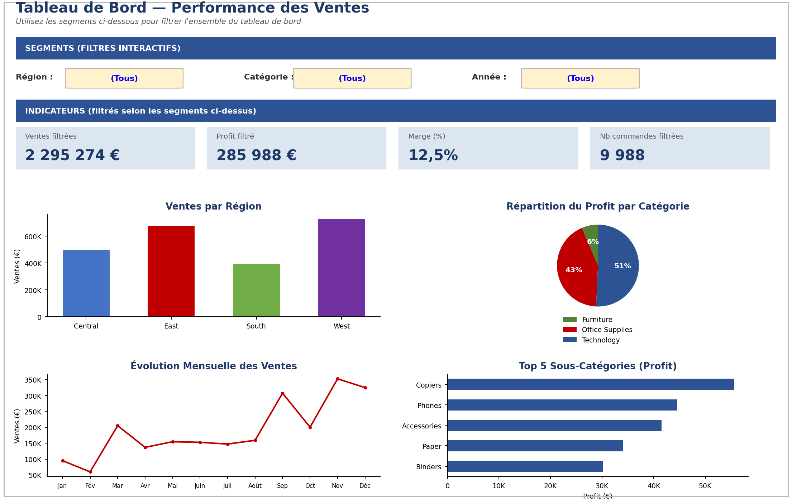
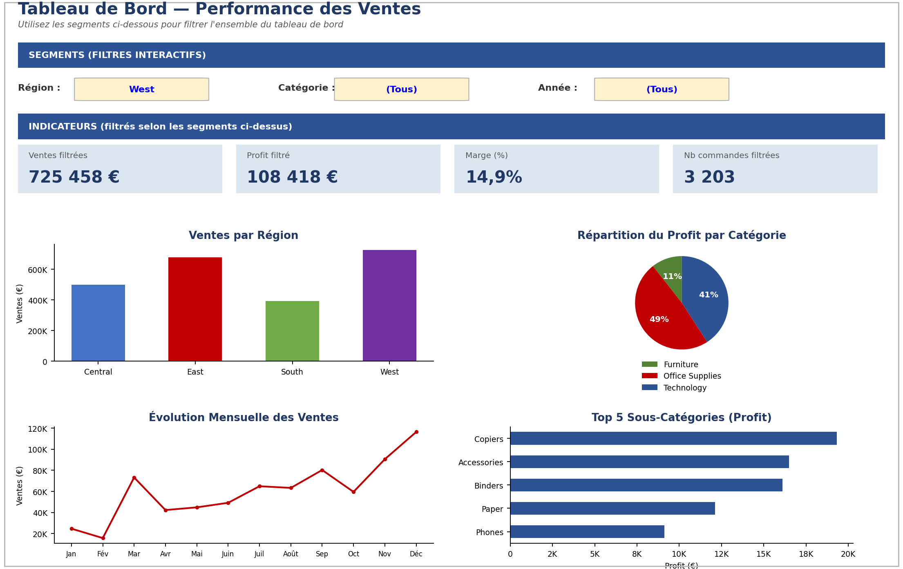

# 📊 Suivi & Visualisation des Performances de Ventes — Dashboard Excel Interactif

Tableau de bord interactif pour suivre les ventes, marges et performances régionales d'une entreprise de vente au détail, et identifier les zones à améliorer.

> 📁 Fichier livrable : [`Dashboard_Ventes.xlsx`](./Dashboard_Ventes.xlsx)  ·  👁️ [**Ouvrir en ligne (Office Viewer)**](https://view.officeapps.live.com/op/view.aspx?src=https%3A%2F%2Fraw.githubusercontent.com%2FIssa0900%2FIssa-Ouedraogo%2Fmain%2Fdashboard-ventes-performance%2FDashboard_Ventes.xlsx)  ·  ⬇️ [Télécharger](https://github.com/Issa0900/Issa-Ouedraogo/raw/main/dashboard-ventes-performance/Dashboard_Ventes.xlsx)
>
> ℹ️ GitHub ne sait pas prévisualiser correctement les fichiers Excel complexes (formules, graphiques, feuille masquée, filtres). Utilise le lien **"Ouvrir en ligne"** ci-dessus pour consulter le vrai fichier dans ton navigateur, ou télécharge-le pour l'ouvrir dans Excel et tester les filtres. Les aperçus ci-dessous montrent exactement ce que tu y trouveras.

---

## 🎬 Aperçu — filtrage interactif

Le dashboard se pilote entièrement via 3 segments (Région / Catégorie / Année). Exemple : en filtrant sur **Région = West**, tous les indicateurs et graphiques se recalculent instantanément.

| Vue par défaut (Tous) | Vue filtrée (Région = West) |
|---|---|
|  |  |
| Ventes : 2 295 274 € · Marge : 12,5 % | Ventes : 725 458 € · Marge : 14,9 % |

---

## 🧩 Contexte métier

Une entreprise souhaite suivre ses performances de ventes par **région** et par **catégorie de produits** afin d'identifier les segments à fort potentiel et ceux qui pèsent sur la rentabilité. L'objectif est de transformer un fichier de transactions brut en un outil de pilotage exploitable par des décideurs non-techniques.

## 🎯 Objectif du projet

Construire un tableau de bord Excel interactif permettant d'analyser en temps réel les KPI clés (ventes, profit, marge, volume) par région et par catégorie, avec des filtres dynamiques et des visualisations claires.

## 🗂️ Données

| | |
|---|---|
| **Source** | [Sample Superstore](https://www.kaggle.com/datasets/vivek468/superstore-dataset-final) — dataset de référence en analyse de données retail |
| **Période** | Janvier 2014 – Décembre 2017 |
| **Volume** | 9 988 lignes de transactions (après nettoyage), 5 008 commandes |
| **Dimensions** | 4 régions, 3 catégories, 17 sous-catégories |

**Nettoyage effectué** (9 994 → 9 988 lignes) :
- Suppression de 2 lignes de bruit en fin de fichier (ligne vide + faux total)
- Normalisation des formats numériques mixtes (séparateurs décimaux `,`/`.` incohérents dans le fichier source)
- Suppression de 6 lignes avec métriques manquantes (ventes/quantité/profit)
- Parsing des dates, typage des colonnes

## 🛠️ Compétences techniques démontrées

- **Nettoyage et structuration des données** : détection d'anomalies, normalisation, table structurée Excel (`ListObject`)
- **Formules Excel essentielles** : `SOMME`, `SOMME.SI`, `SOMME.SI.ENS`, `MOYENNE`, `RECHERCHEV`, `INDEX`/`EQUIV`
- **Analyse croisée** : tableaux Région × Catégorie (équivalent TCD) avec mise en forme conditionnelle (heatmap, data bars)
- **Filtres interactifs** ("segments") pilotant l'ensemble du dashboard en temps réel
- **Graphiques dynamiques** : barres, secteurs, courbe d'évolution, classement — tous liés aux filtres
- **Automatisation Python** (`pandas`, `openpyxl`) : le classeur entier est généré par script, ce qui le rend reproductible et versionnable

## 📁 Structure du classeur

| Onglet | Contenu |
|---|---|
| `Guide` | Notice d'utilisation et choix méthodologiques |
| `Dashboard` | Filtres interactifs + 4 indicateurs clés + 4 graphiques dynamiques |
| `Donnees` | Table structurée des transactions nettoyées |
| `Analyse_Croisee` | Tableaux croisés Région × Catégorie (ventes, profit) + top sous-catégories |
| `KPI` | Indicateurs globaux et démonstration des formules essentielles |
| `Calc_Dashboard` | Feuille de calcul technique (masquée) alimentant les filtres et graphiques |

## 💡 Insights clés

- **Marge globale : 12,5 %** — Ventes totales de 2,30 M$ pour un profit de 286 K$
- **La région West génère le plus de ventes** (725 K$), suivie de East (679 K$) ; **South est la plus faible** (391 K$)
- **La catégorie Technology est la plus rentable** (145 K$ de profit), loin devant Furniture (18 K$) malgré des ventes comparables — signe d'un problème de marge sur le mobilier
- **Deux sous-catégories sont déficitaires : Tables (-17,7 K$) et Bookcases (-3,5 K$)** — probablement liées à des remises excessives, à creuser en priorité

## 🚀 Comment tester l'interactivité toi-même

1. Télécharger [`Dashboard_Ventes.xlsx`](./Dashboard_Ventes.xlsx) et l'ouvrir dans Excel (le classeur se recalcule automatiquement à l'ouverture)
2. Aller sur l'onglet **Dashboard**
3. Changer les listes déroulantes (cellules jaunes) — **Région**, **Catégorie**, **Année**
4. Observer les 4 indicateurs et les 4 graphiques se mettre à jour instantanément, sans macro ni manipulation supplémentaire

## 🧠 Choix méthodologique : segments sans TCD natif

Le classeur est généré par script Python (`openpyxl`), qui ne permet pas de créer de véritables **Slicers Excel natifs** liés à un TCD natif. Pour conserver une expérience de filtrage interactif tout en gardant un fichier 100 % reproductible et versionnable, les "segments" ont été implémentés avec des **listes déroulantes (validation de données) pilotant des formules `SOMME.SI.ENS`/`SUMIFS`** — même résultat pour l'utilisateur final, sans dépendance à une manipulation manuelle dans Excel. Un TCD natif avec segments peut aussi être ajouté directement sur la table `TblVentes` pour qui préfère l'outil natif.

## 📬 Contact

Réalisé par **Issa Ouedraogo** — [issaouedraogo0900@gmail.com](mailto:issaouedraogo0900@gmail.com)
