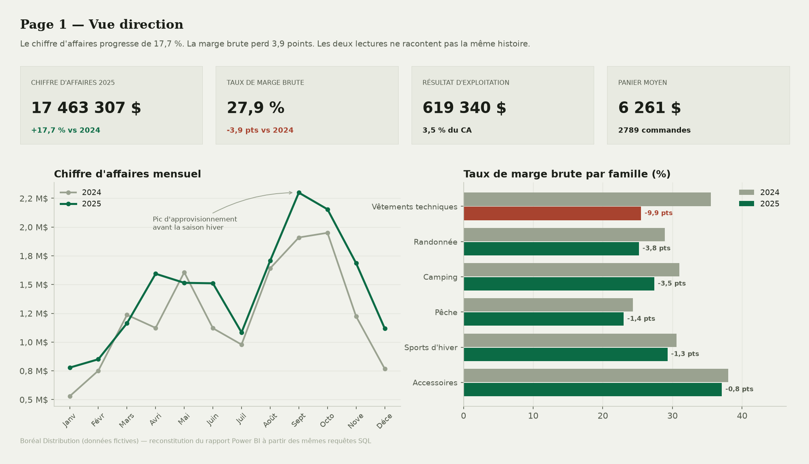
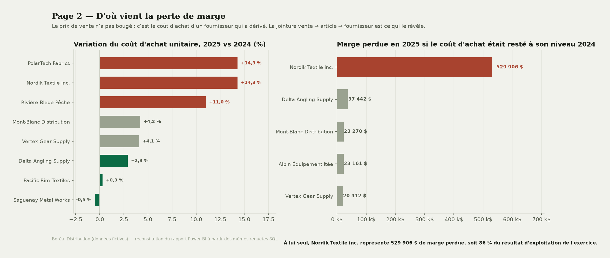
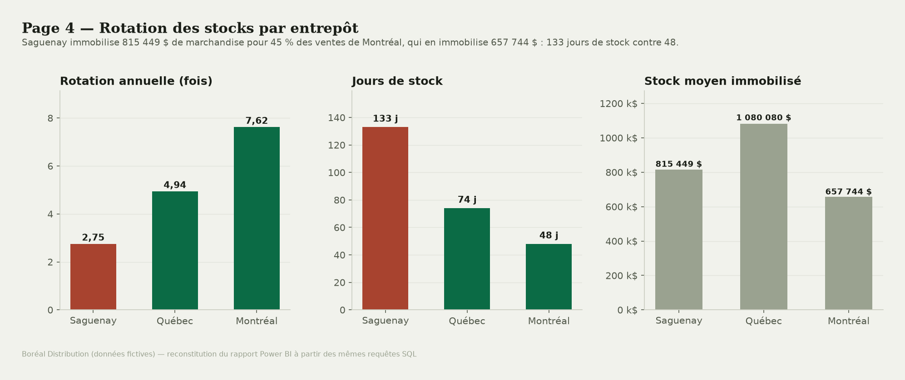
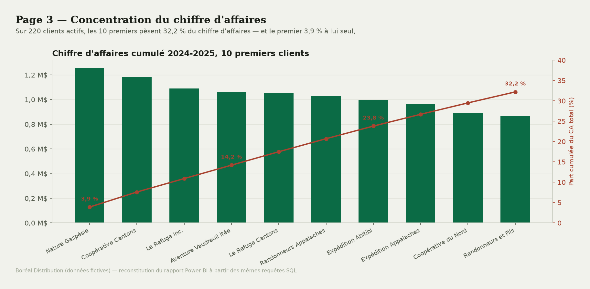
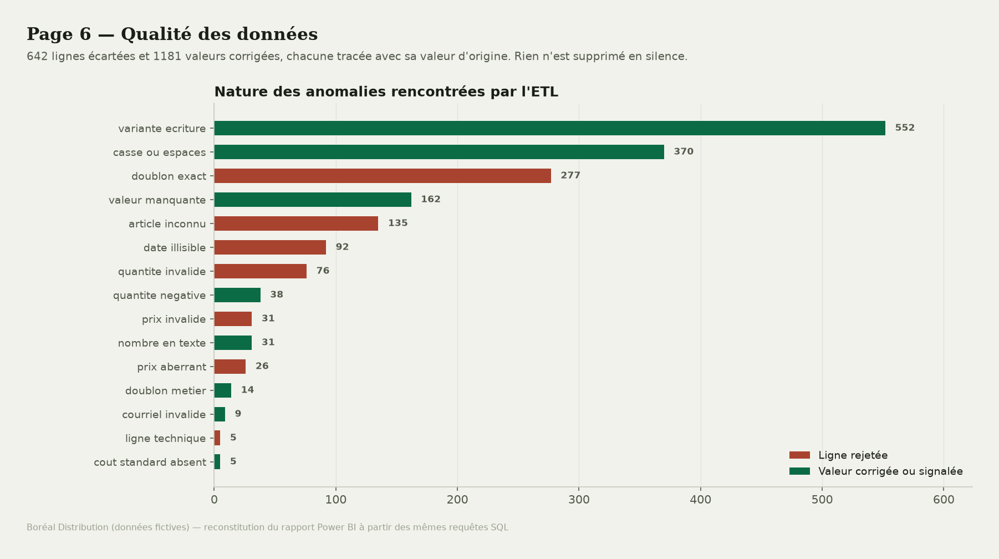

# 🏢 Entrepôt de données & tableau de bord Power BI


Chaîne décisionnelle complète pour une PME de distribution : **8 sources hétérogènes**
(ERP, CRM, RH, comptabilité) dans 4 formats et 3 encodages, nettoyées par un ETL traçable,
chargées dans un **entrepôt en étoile** de 14 tables, puis exposées à Power BI avec
49 mesures DAX documentées.

> 📊 [Résultats d'analyse](https://github.com/Issa0900/Issa-Ouedraogo/blob/main/entrepot-donnees-powerbi/data/ANALYSE.md) · 🧹 [Rapport qualité](https://github.com/Issa0900/Issa-Ouedraogo/blob/main/entrepot-donnees-powerbi/data/RAPPORT-QUALITE.md) ·
> 📐 [Guide Power BI](https://github.com/Issa0900/Issa-Ouedraogo/blob/main/entrepot-donnees-powerbi/PowerBI/GUIDE-POWERBI.md) · 🗄️ [Schéma en étoile](https://github.com/Issa0900/Issa-Ouedraogo/blob/main/entrepot-donnees-powerbi/SQL/1_creation_schema.sql)



---

## ⚠️ Sur les données : elles sont fictives, et c'est délibéré

Contrairement aux autres projets de ce portfolio, ce jeu de données est **entièrement
généré** (`Python/1_generer_sources.py`). Deux raisons l'imposaient :

**Aucun jeu public ne couvre une PME de bout en bout.** L'intérêt du projet est de croiser
ventes, achats, stocks, paie, marketing et comptabilité d'une *même* entreprise. Les jeux
ouverts sont des silos : un fichier de ventes, ou un fichier RH, jamais les deux reliés.
Or c'est précisément la jointure entre sources qui produit ici le principal résultat.

**Les défauts devaient être connus pour que le nettoyage soit vérifiable.** Le générateur
journalise chaque anomalie qu'il injecte ; l'ETL journalise chaque anomalie qu'il détecte.
Confronter les deux journaux mesure ce qui échappe réellement au nettoyage — impossible
sur un fichier réel, dont on ignore par définition les erreurs.

Les données sont fictives, mais **aucun chiffre de ce README n'est inventé** : tous
sortent des requêtes de `SQL/2_requetes_analyse.sql`, et les principaux ont été
recalculés indépendamment avec `pandas` avant d'être cités.

---

## 🧩 Contexte métier

**Boréal Distribution inc.** est un grossiste québécois d'équipement de plein air :
47 employés, 3 entrepôts (Québec, Montréal, Saguenay), 182 articles, 220 détaillants
clients au Québec, en Ontario et dans les Maritimes.

Comme beaucoup de PME, l'entreprise a des données — mais dispersées dans quatre systèmes
qui ne se parlent pas. Le directeur général voit le chiffre d'affaires dans l'ERP, les
coûts dans le logiciel comptable, les stocks dans un fichier Excel maintenu par
l'entrepôt. Chaque système donne une réponse partielle, aucun ne donne la réponse à la
seule question qui compte cette année : **le chiffre d'affaires progresse, alors pourquoi
la rentabilité ne suit-elle pas ?**

## 🎯 Objectif du projet

Construire la chaîne complète qui permet de répondre à cette question : consolider les
sources, rendre les données fiables et traçables, les modéliser pour l'analyse, et livrer
un modèle Power BI où la réponse se lit en deux clics.

---

## 🗂️ Les données

| | |
|---|---|
| **Sources** | 8 fichiers : ERP ventes (2 exercices), CRM clients, RH & paie, achats fournisseurs, inventaire, campagnes marketing, charges comptables, catalogue produits |
| **Formats** | CSV point-virgule, CSV tabulation, CSV virgule, JSON imbriqué, XLSX à deux feuilles |
| **Encodages** | cp1252 (ERP), latin-1 (comptabilité), UTF-8 (systèmes récents) |
| **Période** | 1ᵉʳ janvier 2024 – 31 décembre 2025 (24 mois complets) |
| **Volume brut** | ≈ 30 900 lignes, dont 16 127 lignes de commande |
| **Après chargement** | 14 tables, 32 967 lignes |

### Les défauts à traiter

Ils reproduisent ceux qu'on rencontre réellement dans des exports de PME :

- **trois formats de date dans un même fichier** (`05/03/2024`, `2024-03-05`, `05-mars-24`) — l'ERP a changé de configuration deux fois en deux ans ;
- **montants au format francophone** : virgule décimale, symbole `$`, et **espace insécable** (`U+00A0`) comme séparateur de milliers — invisible à l'œil, fatal pour `float()` ;
- **doublons d'import** : un lot de commandes chargé deux fois dans l'ERP ;
- **doublons métier** : la même entreprise saisie sous deux codes clients différents ;
- **variantes d'écriture** : `QC`, `Quebec`, `Québec`, `qc` pour une seule province ;
- **clés orphelines** : des références articles absentes du catalogue ;
- **erreurs de saisie** : virgule oubliée sur un prix (×1000), quantités négatives, prix à zéro ;
- **lignes non-données** : totaux et pieds de page ajoutés par l'outil d'export ;
- **valeurs manquantes** : canal de vente, code postal, budget marketing ;
- **nombres stockés en texte** dans le classeur RH (`52 000 $`).

### Ce que le nettoyage a produit

**642 lignes rejetées** et **1 181 valeurs corrigées ou signalées**, toutes tracées avec
leur valeur d'origine dans la table `qualite_rejets`.

| Source | Lignes lues | Chargées | Retenue |
|---|---:|---:|---:|
| ERP ventes | 16 127 | 15 683 | 97,2 % |
| Inventaire | 10 480 | 10 335 | 98,6 % |
| Achats fournisseurs | 2 122 | 2 097 | 98,8 % |
| RH paie | 1 002 | 1 002 | 100 % |
| Charges comptables | 569 | 552 | 97,0 % |
| CRM clients | 234 | 220 | 94,0 % |
| Catalogue produits | 190 | 182 | 95,8 % |
| Marketing | 84 | 84 | 100 % |
| RH employés | 50 | 47 | 94,0 % |

### La vérification qui rend le nettoyage crédible

Le générateur et l'ETL tiennent chacun leur journal, sans se consulter. Les confronter
donne, sur 15 natures d'anomalies, **14 correspondances exactes à l'unité près** :

| Nature du défaut | Injecté | Détecté |
|---|---:|---:|
| Variante d'écriture | 552 | 552 |
| Casse ou espaces parasites | 370 | 370 |
| Doublon exact | 277 | 277 |
| Valeur manquante | 162 | 162 |
| Article inconnu | 135 | 135 |
| Date illisible | 92 | 92 |
| Quantité invalide | 76 | 76 |
| Quantité négative (retour) | 38 | 38 |
| Prix invalide | 31 | 31 |
| Nombre stocké en texte | 32 | **31** |
| Prix aberrant | 26 | 26 |
| Doublon métier | 14 | 14 |
| Courriel invalide | 9 | 9 |
| Coût standard absent | 5 | 5 |
| Ligne technique | 5 | 5 |

Le seul écart est expliqué, pas dissimulé : un salaire en texte figurait sur la ligne d'un
employé en double, écartée plus tôt comme doublon exact — le défaut de format n'a donc
jamais eu à être corrigé. Le détail est dans [`data/RAPPORT-QUALITE.md`](https://github.com/Issa0900/Issa-Ouedraogo/blob/main/entrepot-donnees-powerbi/data/RAPPORT-QUALITE.md).

---

## 💡 Ce que le tableau de bord révèle

### 1. La croissance masque une érosion de la marge

Le chiffre d'affaires passe de **14 838 000 $ à 17 463 307 $ (+17,7 %)**. Lu seul, c'est
un bon exercice. Mais le taux de marge brute recule de **31,8 % à 27,9 %**, soit
**−3,9 points**. Résultat : la marge brute ne progresse que de 3,2 % quand les ventes
avancent de 17,7 %. La croissance a été payée, pas encaissée.

### 2. Un seul fournisseur explique l'essentiel de la perte



Le prix de vente n'a pas bougé : c'est le coût d'achat qui a dérivé. En remontant
*vente → article → fournisseur* — une jointure qu'**aucune des trois sources ne permet à
elle seule** — le coût unitaire moyen payé à **Nordik Textile inc. augmente de 14,3 %**
en 2025, alors que le fournisseur pèse 48 articles et 4,65 M$ de ventes.

À volumes et prix de vente identiques, la marge 2025 aurait été supérieure de
**529 906 $** si le coût d'achat était resté à son niveau 2024. C'est **86 % du résultat
d'exploitation de l'exercice** (619 340 $) : renégocier ce seul contrat pèserait presque
autant que toute la croissance réalisée.

L'effet se lit aussi par famille : **Vêtements techniques perd 9,9 points de marge**,
contre −0,9 point pour les Accessoires, que ce fournisseur n'approvisionne pas.

Le même fournisseur cumule par ailleurs **25 % de livraisons en retard**, avec 10,9 jours
de retard moyen — le plus élevé de son volume.

### 3. Un entrepôt immobilise trois fois trop de marchandise



Saguenay tourne **2,75 fois par an contre 7,62 à Montréal**, soit **133 jours de stock
contre 48**. Pour 45 % du volume de ventes de Montréal, l'entrepôt immobilise 24 % de
marchandise en *plus* (815 449 $ contre 657 744 $). À la rotation de Montréal, le même volume de ventes
n'exigerait que 294 000 $ de stock : l'écart représente environ **520 000 $ de
trésorerie immobilisée** sans contrepartie commerciale.

### 4. Les délais d'encaissement se dégradent

Le délai moyen de paiement client passe de **40,4 à 50,3 jours** entre les deux exercices,
et l'encours non réglé atteint **2 886 672 $** fin 2025. L'entreprise finance de fait ses
clients pendant dix jours de plus qu'auparavant — sur un résultat d'exploitation de
619 340 $, la dégradation n'est pas anodine.

### 5. Le budget marketing est concentré sur le canal le moins efficace

| Canal | Dépense | Nouveaux clients | Coût par client |
|---|---:|---:|---:|
| Courriel | 26 934 $ | 133 | **203 $** |
| Publicité numérique | 142 545 $ | 152 | 938 $ |
| Commandite locale | 42 946 $ | 9 | 4 772 $ |
| Catalogue imprimé | 47 006 $ | 7 | 6 715 $ |
| Salons professionnels | 177 621 $ | 18 | **9 868 $** |

Les salons professionnels absorbent **40 % du budget marketing** pour un coût
d'acquisition **49 fois supérieur** à celui du courriel. La nuance à poser : le
rattachement d'un client à un canal vient du suivi manuel des campagnes, pas d'un modèle
d'attribution — ces chiffres comparent des canaux, ils ne démontrent pas une causalité.

### 6. Une dépendance commerciale à surveiller



Sur 220 clients actifs, les **10 premiers pèsent 32,2 %** du chiffre d'affaires. Aucun ne
dépasse 4 % à lui seul : la concentration est réelle mais pas critique. C'est le genre de
constat qu'un tableau de bord doit permettre de *surveiller* plutôt que de dramatiser.

### 7. Contrepoint : la productivité, elle, progresse

Toutes les nouvelles ne sont pas mauvaises. À effectif constant (44 employés payés),
le chiffre d'affaires par employé passe de **337 227 $ à 396 893 $**, et la masse
salariale recule de 18,7 % à **15,9 % du chiffre d'affaires**. Le problème de l'exercice
est un problème d'achats, pas de structure.

---

## 🧹 La qualité des données comme page du rapport



La sixième page du tableau de bord affiche ce que l'ETL a écarté. C'est un choix de
conception : un rapport qui ne montre jamais ses rejets demande une confiance aveugle.
Ici, chaque ligne écartée reste consultable avec sa valeur d'origine, son fichier source
et le motif de la décision.

**Règle appliquée : rien n'est jamais imputé.** Un code postal absent reste vide, un
courriel invalide passe à NULL. Remplacer une valeur manquante par une moyenne
fabriquerait une donnée qui n'a jamais existé — et la rendrait indiscernable des vraies.

| Situation | Décision | Pourquoi |
|---|---|---|
| Format réparable (date, montant, casse) | Corrigée, ligne conservée | Le défaut est de forme, l'information métier est intacte |
| Variante d'écriture | Normalisée par table de correspondance | Une règle de casse automatique casserait `Logiciels et TI` |
| Valeur absente | Conservée à NULL | Imputer fabriquerait une donnée inexistante |
| Clé métier introuvable | Rejetée, tracée | Rattacher à un « divers » fausserait toute analyse par famille |
| Ligne strictement identique | Rejetée, tracée | Double import : la conserver doublerait le chiffre d'affaires |
| Deux fiches, même entreprise | Fusionnées, ventes rattachées | Sinon le CA d'un client est éclaté et la concentration sous-estimée |
| Quantité négative sur un achat | Conservée, qualifiée de retour | Ce n'est pas une erreur, c'est une opération réelle |

---

## 🏛️ Le modèle : schéma en étoile

7 dimensions, 6 tables de faits, 1 table de qualité — [DDL complet](https://github.com/Issa0900/Issa-Ouedraogo/blob/main/entrepot-donnees-powerbi/SQL/1_creation_schema.sql).

| Table de faits | Grain | Dimensions rattachées |
|---|---|---|
| `fait_ventes` | une ligne d'article dans une commande client | date (×3), client, produit, entrepôt, employé |
| `fait_achats` | une ligne d'article dans une commande fournisseur | date (×3), fournisseur, produit |
| `fait_stock` | une photo mensuelle par article et entrepôt | date, entrepôt, produit |
| `fait_paie` | un employé, un mois | date, employé |
| `fait_marketing` | un canal, un mois | date, canal |
| `fait_charges` | une catégorie, un entrepôt, un mois | date, entrepôt |

`dim_date` est partagée par les six tables de faits — c'est la condition pour que les
comparaisons temporelles de Power BI fonctionnent sur l'ensemble du modèle.
`dim_fournisseur` se rattache à `dim_produit` plutôt qu'aux faits (modèle en flocon) :
c'est ce maillon qui permet de remonter d'une vente jusqu'au fournisseur de l'article.

Trois décisions de modélisation méritent d'être signalées.

**Le grain reste la ligne de commande.** Rien n'est pré-agrégé dans l'entrepôt : c'est
Power BI qui agrège. Pré-calculer des totaux par mois aurait allégé le modèle, mais
interdit tout forage — et c'est justement en descendant jusqu'à l'article puis au
fournisseur qu'on trouve l'origine de la perte de marge.

**Le coût est figé au moment de la vente.** `fait_ventes` porte son propre `cout_unitaire`
plutôt que de renvoyer au coût standard du catalogue. Recalculer la marge historique à
partir du catalogue courant réécrirait le passé à chaque changement de tarif — et aurait
effacé exactement le phénomène que le projet cherche à mettre en évidence.

**`fait_stock` est une table de photos, pas de flux.** Elle contient l'état du stock à
douze instants par an. La sommer sur l'axe du temps donnerait un stock douze fois trop
élevé et une rotation douze fois trop basse ; les mesures DAX correspondantes sont donc
semi-additives (`AVERAGEX` sur les mois, `LASTNONBLANK` pour l'état final).

---

## 📐 Le modèle Power BI

Le dépôt fournit tout ce qu'il faut pour reconstruire le rapport en une quarantaine de
minutes : les 14 CSV prêts à l'import, les 21 relations à créer, et
**[49 mesures DAX](https://github.com/Issa0900/Issa-Ouedraogo/blob/main/entrepot-donnees-powerbi/PowerBI/mesures.dax)** commentées et vérifiées contre les requêtes SQL.

Trois points techniques que le [guide](https://github.com/Issa0900/Issa-Ouedraogo/blob/main/entrepot-donnees-powerbi/PowerBI/GUIDE-POWERBI.md) détaille, parce qu'ils
sont la cause de la grande majorité des chiffres faux dans un rapport Power BI :

- **Désactiver la date/heure automatique avant tout import.** Laissée active, Power BI crée
  une table de dates masquée par colonne de date — une dizaine ici — et les fonctions de
  comparaison annuelle référencent ces tables fantômes plutôt que `dim_date`. Les
  comparaisons deviennent fausses sans le moindre message d'erreur.
- **`fait_ventes` porte trois dates** (commande, livraison, paiement). Power BI n'autorise
  qu'une relation active entre deux tables : les deux autres restent inactives et
  s'activent à la demande avec `USERELATIONSHIP`. C'est ainsi que la mesure `CA encaissé`
  lit le même chiffre d'affaires sur la date d'encaissement, sans dupliquer la table de dates.
- **Encodage et séparateurs à l'export.** Les CSV sont écrits en UTF-8 **avec BOM**
  (sans quoi Power BI applique l'encodage système et `Vêtements` devient `Vêtements`),
  avec décimale point et dates ISO — sur une machine configurée en anglais,
  `03/05/2025` serait lu comme le 5 mars au lieu du 3 mai, silencieusement.

Le guide se termine par un tableau de dix valeurs de référence à comparer après
construction : si une mesure ne retombe pas sur le chiffre calculé en SQL, c'est la mesure
qui est fausse.

> **Note d'honnêteté** — le fichier `.pbix` n'est pas encore dans le dépôt. Les aperçus
> de ce README ne sont pas des captures de Power BI : ce sont des reconstitutions
> `matplotlib` des mêmes pages, alimentées par **les mêmes requêtes SQL**
> (`Python/6_generer_graphiques.py`). Les chiffres affichés sont donc exactement ceux du
> rapport, pas une illustration approximative.

---

## 🛠️ Compétences techniques démontrées

- **Ingestion multi-format et multi-encodage** — CSV à trois délimiteurs, JSON imbriqué,
  XLSX à deux feuilles dont l'en-tête n'est pas en première ligne, cp1252 / latin-1 / UTF-8
- **Nettoyage traçable** — chaque décision journalisée avec la valeur d'origine ; distinction
  explicite entre correction, normalisation, rejet et signalement
- **Rapprochement de doublons métier** — appariement sur raison sociale normalisée + courriel,
  fusion des fiches et réaffectation des ventes au client conservé
- **Modélisation dimensionnelle** — schéma en étoile, clés de substitution, table de dates
  continue, gestion des faits semi-additifs
- **SQL analytique** — CTE, fonctions de fenêtrage (`ROW_NUMBER`, `SUM OVER`), agrégations
  conditionnelles, analyse contrefactuelle (marge à coût constant)
- **DAX** — time intelligence, relations inactives et `USERELATIONSHIP`, mesures
  semi-additives, `TOPN` avec `KEEPFILTERS`
- **Validation croisée** — chaque chiffre publié recalculé par un second chemin
  (`pandas` contre SQL) avant d'être cité
- **Pipeline reproductible** — graine aléatoire fixe, six scripts numérotés, aucune étape manuelle

---

## 📁 Structure du projet

| Fichier | Rôle |
|---|---|
| `Python/1_generer_sources.py` | Génère les 8 sources brutes et journalise les anomalies injectées |
| `Python/2_nettoyer_charger.py` | ETL : nettoie, valide, rapproche, charge l'entrepôt SQLite |
| `Python/3_controle_qualite.py` | Confronte anomalies injectées et détectées → `data/RAPPORT-QUALITE.md` |
| `Python/4_analyser.py` | Exécute les requêtes d'analyse → `data/ANALYSE.md` |
| `Python/5_exporter_powerbi.py` | Exporte les 14 tables en CSV prêts pour Power BI |
| `Python/6_generer_graphiques.py` | Reconstitue les pages du rapport en PNG |
| `SQL/1_creation_schema.sql` | DDL du schéma en étoile (dimensions, faits, index) |
| `SQL/2_requetes_analyse.sql` | 13 requêtes d'analyse, source de tous les chiffres cités |
| `PowerBI/GUIDE-POWERBI.md` | Import, relations, table de dates, 6 pages, valeurs de contrôle |
| `PowerBI/mesures.dax` | 49 mesures commentées |
| `data/brut/` | Les 8 sources telles qu'un système les exporterait |
| `data/powerbi/` | Les 14 tables nettoyées, prêtes à importer |
| `data/ANALYSE.md` | Résultats des 13 analyses |
| `data/RAPPORT-QUALITE.md` | Réconciliation qualité et volumétrie |

## 🚀 Reproduire le pipeline

```bash
pip install openpyxl matplotlib pandas
python Python/1_generer_sources.py      # 8 sources brutes
python Python/2_nettoyer_charger.py     # ETL + entrepôt SQLite
python Python/3_controle_qualite.py     # rapport qualité
python Python/4_analyser.py             # résultats d'analyse
python Python/5_exporter_powerbi.py     # CSV pour Power BI
python Python/6_generer_graphiques.py   # aperçus PNG
```

L'ensemble s'exécute en moins de dix secondes. La graine aléatoire étant fixe, le jeu de
données régénéré est identique au bit près : **tous les chiffres de ce README restent
valables après une réexécution complète**.

L'entrepôt `data/entrepot/boreal.db` n'est pas versionné (c'est un artefact de
construction, régénéré par le script 2). Les sources brutes et les exports Power BI, eux,
sont dans le dépôt et consultables directement.

---

## 🧠 Choix méthodologiques

**Le nettoyage devait être mesurable, pas seulement affirmé.** Dire « les données ont été
nettoyées » n'engage à rien. Faire tenir deux journaux indépendants — l'un par le
générateur, l'autre par l'ETL — et publier leur confrontation transforme une affirmation
en mesure. C'est aussi ce qui a permis de trouver deux vrais défauts de mon propre ETL
pendant le développement : une normalisation de ville qui produisait « Thunder bay » et
« Saint-Jean-Sur-Richelieu », et des corrections journalisées sur des lignes destinées à
être rejetées comme doublons, ce qui gonflait les compteurs. Sans la réconciliation, les
deux seraient passés inaperçus.

**Rejeter plutôt qu'imputer, mais toujours en le disant.** Chaque ligne écartée est
consultable dans le rapport, avec sa valeur d'origine. Un tableau de bord qui affiche
32 967 lignes chargées sans dire qu'il en a écarté 642 raconte une histoire incomplète.

**Nommer un facteur, pas une cause.** Les données montrent que le coût unitaire payé à
Nordik Textile a augmenté de 14,3 % et que cela représente 529 906 $ de marge. Elles ne
disent pas *pourquoi* : hausse de matière première, renégociation ratée, changement de
gamme ? Le modèle ne contient pas cette information, et le rapport ne le prétend pas.
Il indique où regarder, pas ce qu'il faut conclure.

**Préférer une limite documentée à un chiffre confortable.** Le rattachement d'un nouveau
client à un canal marketing est déclaratif, pas attribué. Le coût par client reste utile
pour comparer des canaux, mais il ne prouve pas une causalité — et le rapport le dit à
l'endroit où le chiffre s'affiche, pas dans une note de bas de page.

---

## 📬 Contact

Réalisé par **Issa Ouedraogo**, [issaouedraogo0900@gmail.com](mailto:issaouedraogo0900@gmail.com)


[← Retour au portfolio](../)
