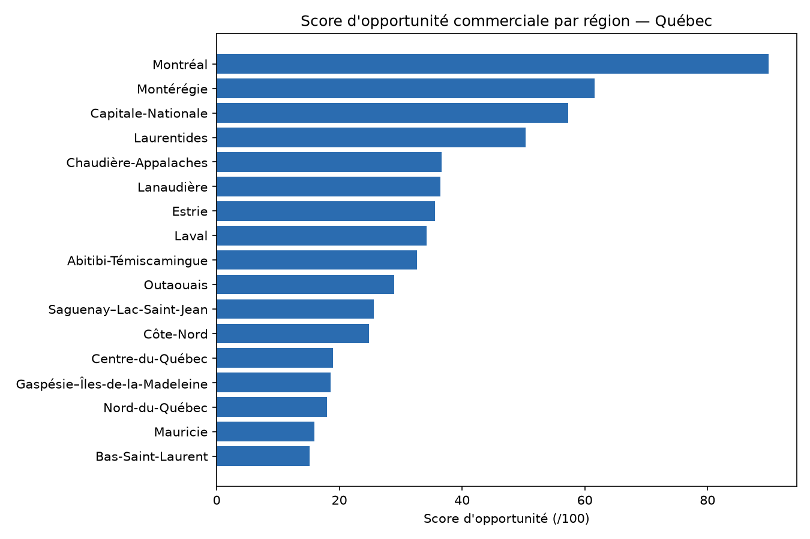
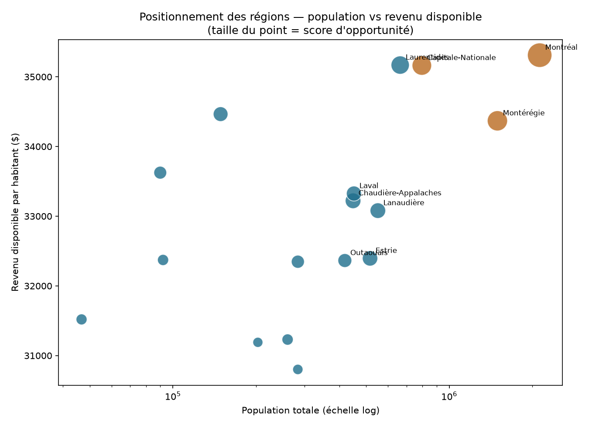
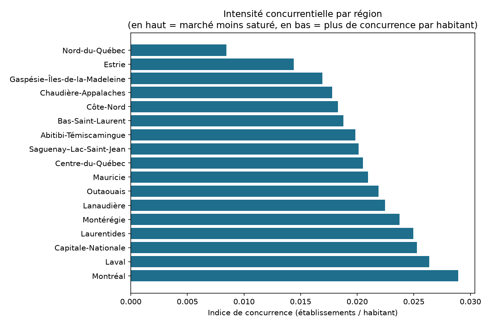

# 🗺️ Geomarketing Québec : où une PME devrait-elle investir ?


Score d'opportunité commerciale calculé pour les 17 régions administratives du Québec (population, revenu disponible, croissance démographique, intensité concurrentielle), à partir de 257 755 établissements du registre des entreprises et des fiches statistiques régionales de l'ISQ.

> 🌐 **[Présentation interactive complète →](./presentation.html)** · 🗂️ Données : [`data/synthese_regions.csv`](./data/synthese_regions.csv) · 🐍 Pipeline : [`Python/`](./Python/)



---

## 🧩 Contexte métier

Une PME qui veut ouvrir un point de vente ou cibler une campagne marketing au Québec doit arbitrer entre 17 régions administratives très différentes en taille de marché, pouvoir d'achat et niveau de concurrence. Sans données consolidées, cette décision se prend souvent à l'intuition.

## 🎯 Objectif du projet

Construire un score d'opportunité commerciale par région à partir de données publiques réelles, pour répondre concrètement : quelle région a le plus grand marché, laquelle croît le plus vite, où la concurrence est-elle la plus forte, et quelles régions représentent le meilleur compromis marché/concurrence pour une expansion.

## 🗂️ Données

| | |
|---|---|
| **Sources** | Institut de la statistique du Québec (ISQ) — population, croissance, revenu disponible, chômage · Registraire des entreprises du Québec — registre des entreprises (licence CC-BY-NC-SA 4.0) |
| **Volume** | 17 régions administratives · 257 755 établissements |
| **Période** | Population 2023 · revenu disponible 2020-2021 selon la région · chômage 2021-2022 |
| **Variables clés** | Population totale, croissance annuelle, revenu disponible par habitant, taux de chômage, nombre d'établissements, indice de concurrence |

**Obstacle de collecte contourné** : les tableaux dynamiques habituels de l'ISQ (BDSO) n'exposent ni lien CSV ni API — le tableau se charge côté client via une application JS sans endpoint public. Solution retenue : les 17 fiches *"Coup d'œil sur les régions"* de l'ISQ embarquent plusieurs années d'indicateurs en texte, directement dans le HTML servi par le serveur — lisibles par simple requête HTTP, sans navigateur.

**Nettoyage / rattachement effectué** :
- Chaque indicateur (population, revenu, chômage) garde sa propre année de référence — l'ISQ ne republie pas tous les indicateurs à chaque édition de la fiche
- Le registre des entreprises donne une adresse municipale, pas de code de région administrative : les 257 755 établissements ont été rattachés à leur région via un dictionnaire de ~500 municipalités (couvrant environ 81 % des établissements — le reste, hors dictionnaire, est exclu du calcul plutôt que mal classé)
- **Vérification croisée** : somme des 17 populations extraites = 8 874 683, cohérente avec l'estimation officielle du Québec au 1ᵉʳ juillet 2023 (validation indépendante de la fiabilité de l'extraction)

## 🛠️ Compétences techniques démontrées

- **Web scraping ciblé** (`requests`, `re`, JSON embarqué) sur une application JS sans API publique, après avoir écarté plusieurs pistes infructueuses (endpoints devinés, chunks webpack)
- **Nettoyage et rattachement de données géographiques** (ville → région administrative) avec mesure et documentation du taux de couverture
- **Modélisation d'un score composite** (`pandas`) avec normalisation min-max et pondération métier (40 % population, 30 % revenu, 20 % croissance, 10 % faible concurrence)
- **Visualisation** (`matplotlib`) : classement, nuage de points à bulles, comparaison d'indices
- **Conception de schéma relationnel** (SQL) pour les données régionales et d'entreprises
- **Documentation rigoureuse des limites** plutôt que de présenter le résultat comme définitif

## 📁 Structure du projet

| Fichier | Contenu |
|---|---|
| `Python/1_telecharger_entreprises.py` | Télécharge le registre des entreprises (ZIP, ~255 Mo, exclu du dépôt) |
| `Python/2_scraper_isq_regions.py` | Récupère le HTML des 17 fiches régionales ISQ |
| `Python/3_extraire_indicateurs_isq.py` | Extrait population/croissance/revenu/chômage → `data/isq_regions.csv` |
| `Python/4_compter_entreprises_par_region.py` | Rattache les établissements à leur région → `data/entreprises_regions.csv` |
| `Python/5_analyse_marche.py` | Calcule le score d'opportunité → `data/synthese_regions.csv` |
| `Python/6_generer_graphiques.py` | Génère les visualisations dans `assets/` |
| `SQL/creation_base.sql` | Schéma relationnel (régions, population, revenus, entreprises) |
| `data/SOURCES.md` | Sources et méthodologie détaillées |
| `presentation.html` | Page de présentation autonome (ouvre dans tout navigateur) |

## 💡 Insights clés

- **Montréal domine largement** avec un score de 90/100 — 2 124 865 habitants et 61 482 établissements, portée par la taille brute du marché plutôt que par un avantage de revenu (35 311 $/hab., comparable aux Laurentides ou à la Capitale-Nationale).
- **La Montérégie (61,6/100) et la Capitale-Nationale (57,3/100) suivent**, avec un revenu disponible par habitant équivalent ou supérieur à Montréal — un pouvoir d'achat comparable sur un marché plus petit, donc potentiellement moins saturé.
- **Chaudière-Appalaches ressort comme la région la moins concurrentielle** parmi les 5 premières du classement (indice de 0,0178 établissement/habitant, contre 0,0289 à Montréal) avec un revenu disponible de 33 221 $ — un profil « marché à découvrir » plutôt que « marché saturé ».
- **La Gaspésie–Îles-de-la-Madeleine a le taux de chômage le plus élevé** (9,9 %, plus du double de la moyenne des autres régions), un signal à considérer pour cibler une clientèle plutôt qu'une main-d'œuvre dans cette région.
- **Nord-du-Québec a l'indice de concurrence le plus faible** (0,0084) mais aussi la plus petite population (46 703 hab.) — un marché sous-exploité en apparence, mais dont la taille limite le potentiel absolu, illustrant pourquoi le score combine plusieurs variables plutôt qu'une seule.

## 📊 Visualisations

| | |
|---|---|
|  |  |

## 🚀 Comment reproduire l'analyse

```bash
pip install pandas matplotlib requests
python Python/1_telecharger_entreprises.py        # ~255 Mo, une seule fois
python Python/2_scraper_isq_regions.py
python Python/3_extraire_indicateurs_isq.py
python Python/4_compter_entreprises_par_region.py
python Python/5_analyse_marche.py
python Python/6_generer_graphiques.py
```

## 🧠 Choix méthodologique : préférer une donnée scriptable et imparfaite à un export manuel

Les tableaux officiels de l'ISQ auraient donné des chiffres plus récents (revenu disponible 2024 plutôt que 2020-2021) mais seulement via export manuel, page par page, non reproductible. Le choix a été de privilégier une source scriptable de bout en bout — quitte à accepter des données un peu moins récentes — et de **documenter explicitement l'écart** plutôt que de le dissimuler : c'est ce qui rend le pipeline entièrement rejouable (`Python/1_telecharger_entreprises.py` à `6_generer_graphiques.py`) sans intervention manuelle, au prix d'une fraîcheur de donnée légèrement inférieure sur un seul indicateur (revenu disponible). Le même arbitrage s'applique au rattachement ville → région : 81 % de couverture documentée vaut mieux que 100 % obtenu en devinant.

## 📬 Contact

Réalisé par **Issa Ouedraogo**, [issaouedraogo0900@gmail.com](mailto:issaouedraogo0900@gmail.com)
