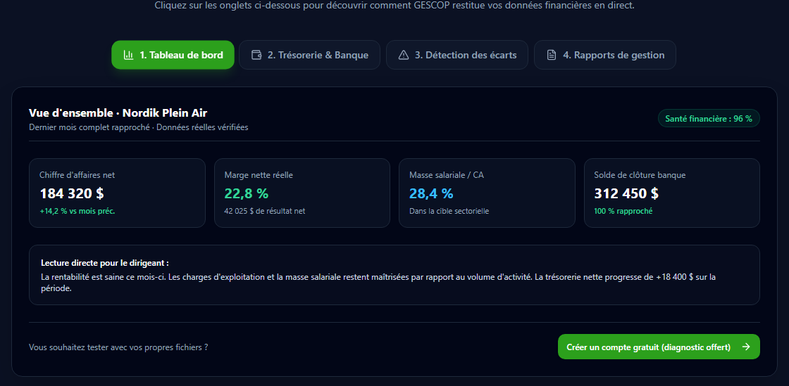
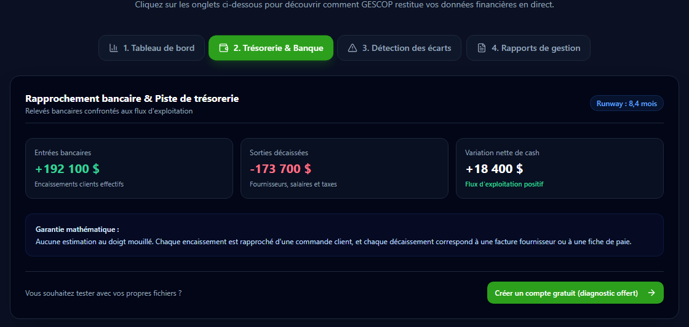
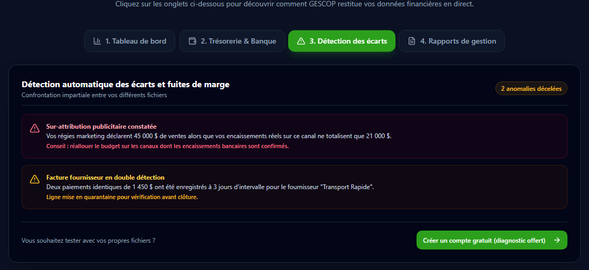
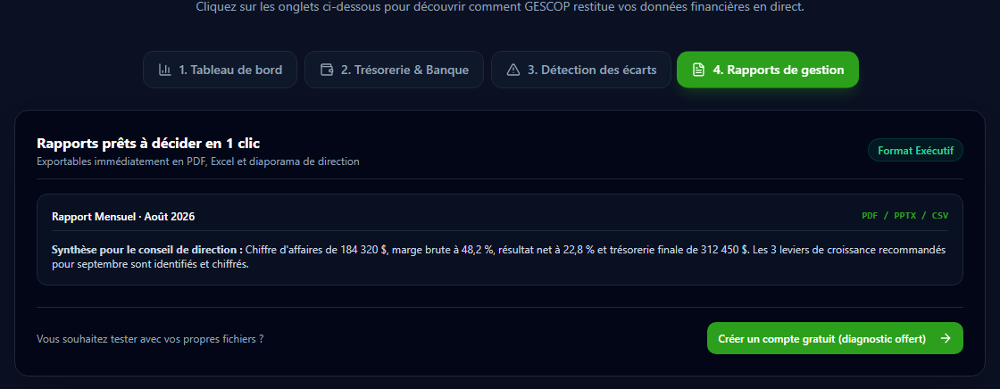

# 🧭 GESCOP · Pilotage financier et aide à la décision pour PME


-000000?style=flat&logo=deno&logoColor=white)


Application web (SaaS) qui transforme les fichiers éparpillés d'une PME (ventes, dépenses, relevés bancaires, paie, stocks) en un tableau de bord financier fiable : marge réelle, trésorerie, écarts entre les sources et rapports de direction.

> 🌐 **Application en ligne : [smart-pilot-gescop.base44.app](https://smart-pilot-gescop.base44.app)** (démonstration interactive sur la page d'accueil, compte d'essai gratuit)
>
> 🔒 Le code source est privé : GESCOP est un produit commercial. Cette page documente le problème, les choix de conception et la méthode de validation.


---

## 🧩 Contexte métier

Dans une PME, les chiffres existent, mais ils sont dispersés : un export du point de vente, un fichier Excel de dépenses, le relevé bancaire en PDF, la paie chez un fournisseur externe, les statistiques des régies publicitaires. Conséquences observées :

- la **marge nette réelle** n'est connue qu'à la remise des états financiers, plusieurs mois après les décisions ;
- les plateformes marketing **s'attribuent des ventes** qui ne se retrouvent pas dans le compte bancaire ;
- la **trésorerie de fin de mois** reste une estimation, ce qui rend chaque échéance de paie stressante ;
- les fichiers contiennent des **doublons, des colonnes nommées différemment et des montants mélangés** (avec ou sans taxes, en plusieurs devises).

## 🎯 Objectif

Permettre à un dirigeant de PME, sans compétence technique, de déposer ses fichiers tels qu'ils sont et d'obtenir des indicateurs **justes et traçables** : chaque chiffre affiché doit pouvoir être rattaché aux lignes qui l'ont produit.

## ⚙️ Ce que fait l'application

| Module | Rôle |
|---|---|
| **Import universel** | Dépôt de fichiers Excel, CSV ou PDF. Reconnaissance automatique des colonnes (lexique métier + IA), du type de données (ventes, dépenses, paie, stocks...) et de leur granularité (ligne de commande, facture, journée). |
| **Qualité des données** | Détection des doublons, des lignes de totaux, des montants avec ou sans taxes, des devises ; les anomalies sont signalées et mises en quarantaine plutôt que supprimées en silence. |
| **Indicateurs (KPI)** | 62 indicateurs définis dans un registre central : chiffre d'affaires HT, marges brute et nette, EBITDA, ratio masse salariale / CA, rotation des stocks, seuil de rentabilité... |
| **Trésorerie et banque** | Rapprochement des relevés bancaires avec les ventes et les dépenses, prévisions à 30, 60 et 90 jours. |
| **Détection des écarts** | Confrontation entre sources : ventes déclarées par les régies publicitaires contre encaissements réels, factures fournisseur payées en double... |
| **Décision** | Alertes, risques, recommandations, simulateur de scénarios et assistant conversationnel sur les données de l'entreprise. |
| **Rapports** | Rapport de direction généré en un clic, exportable en PDF, Excel et diaporama. |
| **Abonnement** | Paiement et gestion d'abonnement par Stripe, essai gratuit. |

<table>
<tr>
<td></td>
<td></td>
</tr>
<tr>
<td></td>
<td></td>
</tr>
</table>

*Captures de la démonstration publique (entreprise fictive « Nordik Plein Air »).*

## 🏗️ Architecture

```
Fichiers de la PME (Excel, CSV, PDF)
        │
        ▼
Fonctions serveur (Deno / TypeScript)
  importData · importMultiData · reprocessImport · resolveDuplicate
  → lecture, reconnaissance des colonnes, normalisation, contrôle qualité
        │
        ▼
Modèle de données unifié (38 entités : Order, Invoice, Payment, Expense,
Payroll, Inventory, Transaction...)
        │
        ▼
Moteur de calcul (registre de KPI, périodes, traçabilité des sources)
        │
        ▼
Interface React : tableaux de bord, alertes, rapports, assistant IA
```

| Élément | Choix |
|---|---|
| Interface | React 18, Vite, Tailwind CSS, composants Radix, TanStack Query |
| Serveur et données | Plateforme Base44 (authentification, base de données, 15 fonctions serveur en Deno/TypeScript) |
| IA | Modèle de langage pour la reconnaissance des colonnes difficiles, les synthèses et l'assistant |
| Paiement | Stripe (paiement, portail client, webhooks) |
| Exports | jsPDF, génération Excel, PptxGenJS |

**Ordre de grandeur :** plus de 30 écrans, environ 59 000 lignes de code applicatif, plus de 500 commits.

## ✅ Fiabilité : des chiffres sur lesquels on peut décider

Un tableau de bord qui affiche un faux chiffre est pire que pas de tableau de bord. La fiabilité est donc au centre de la conception :

- **Chaque chiffre est traçable.** Un KPI affiché peut être rattaché aux lignes et au fichier qui l'ont produit ; le dirigeant voit d'où vient le nombre.
- **Vérifié contre une vérité terrain.** Les calculs de l'application sont confrontés à des résultats calculés de façon indépendante, sur des fichiers d'entreprises réels ou réalistes (jusqu'à 50 000 lignes).
- **Robuste aux fichiers « sales ».** Colonnes renommées ou déplacées, formats de date et de nombre québécois ou américains, séparateurs, lignes de totaux : le même fichier présenté de dizaines de façons différentes doit donner le même résultat.
- **Rien n'est supprimé en silence.** Une ligne douteuse (doublon, montant incohérent) est mise en quarantaine et signalée, jamais effacée sans que le dirigeant le sache.
- **L'IA est encadrée.** Elle aide à reconnaître les colonnes difficiles, mais l'application reste juste même si l'IA se trompe ou ne répond pas : ses propositions sont contrôlées par des règles métier.

## 🧠 Règles métier décidées (et pourquoi)

Une partie du travail n'est pas technique : c'est décider comment l'outil doit se comporter face à des données ambiguës.

- **Corriger la règle, jamais le fichier.** Quand un fichier est mal lu, on corrige la règle générale de reconnaissance, puis on vérifie qu'elle tient pour toutes les variantes de fichiers.
- **Doublons identiques : conservés et signalés**, pas supprimés automatiquement. Deux ventes identiques peuvent être légitimes ; c'est au dirigeant de trancher.
- **Date d'import ≠ date d'inventaire.** Un stock importé aujourd'hui peut décrire la situation d'il y a trois semaines ; les calculs utilisent la date réelle des données.
- **Montants hors taxes pour les KPI**, avec TPS/TVQ traitées à part, pour que les marges soient comparables.
- **Alerte critique par courriel seulement pour un fait nouveau** (pas déjà signalé depuis 30 jours), pour éviter que les alertes deviennent du bruit.

## 🤖 Méthode de travail avec l'IA

GESCOP est développé avec un assistant de programmation IA (Claude Code), selon le processus décrit dans [Intégration IA au flux de travail](../integration-ia/). Mon rôle : définir le produit et les règles métier, cadrer chaque lot de travail, vérifier les résultats sur des données réelles, et décider quand un résultat est assez fiable pour être mis en production.

## 📚 Ce que ce projet m'a appris

- Le plus difficile n'est pas de calculer une marge, c'est de **savoir sur quelles lignes** la calculer (grain, doublons, taxes, périodes).
- La fiabilité se construit dès la conception : une vérification qui ne couvre pas le cas réel (ici, l'intervention de l'IA) ne prouve rien.
- Chaque chiffre affiché à un dirigeant doit être **traçable jusqu'à sa source**, sinon il ne sera pas cru.

## 📬 Contact

**Issa Ouedraogo** · [issaouedraogo0900@gmail.com](mailto:issaouedraogo0900@gmail.com) · [LinkedIn](https://www.linkedin.com/in/issa-ouedraogo-34b146332/)

[← Retour au portfolio](../)
